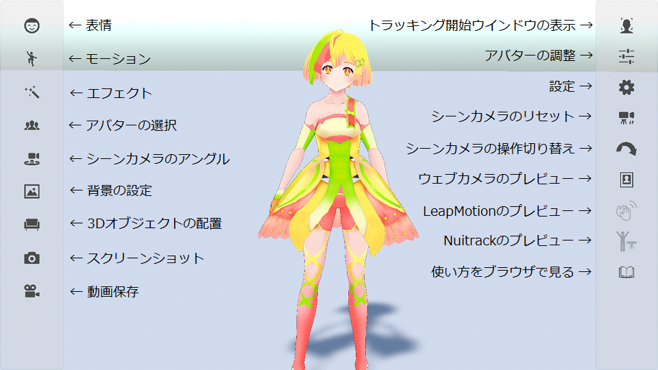

## About the menu

### Description of menu icon

>* The free version does not have a preview icon for Nuitrack.
>* Mac does not have Leap Motion and video save icons.

### Avatar slot

> In 3tene, which supports multiple people, the avatar specified in the avatar slot
> will be the target of various operations.

> Avatar adjustments are for the avatar specified in the avatar slot.
> You need to change the avatar in the slot and make adjustments for the number of people.

> Facial expressions and motions also apply to avatars specified in the avatar slot.

### Tooltip

>If you forget the function of the icon, move the cursor
>Wait a few seconds for the icon.
>A brief description is displayed.

