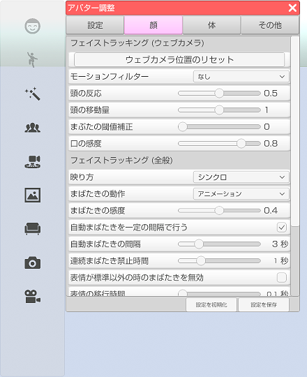

## アバター調整（顔タブ）

>アバターのフェイストラッキングの調整や設定を行います。

### アバター調整のウインドウを表示する

>右側メニューの３番目のアバター調整をクリックします。
>※ 3teneSTUDIO は２番目になります。

>顔タブを選択します。

### フェイストラッキング (3teneSTUDIO のみ対応)

>#### 映り方

>・シンクロ → アバターが顔認識の結果で動きます。（左を向くとアバターは向かって右を向く。）
>・鏡 → アバターが顔認識の左右逆で動きます。（左を向くとアバターは向かって左を向く。）

>#### ウェブカメラ位置のリセット

>ウェブカメラの認識位置をリセットします。

>#### モーションフィルター

>ウェブカメラ使用時に動きにフィルターを通します。

>#### 感度

>値を大きくするとフェイストラッキングの動き出すタイミングが敏感になります。

>#### 倍率

>値を大きくするとフェイストラッキングの動きが激しくなります。

>#### まばたきの動作

>まばたきの動作を変更します。
>・アニメーション → まぶたが一定よりも閉じると自動でまばたきをします。
>・取得パラメータ → 顔認識のまばたの数値を使用します。

>※取得パラメータ動作はウェブカメラだと精度が足りず望んだ結果にならない場合があります。
>　iPhoneX と 3teneFT 使用時にお勧めします。

>#### まばたきの感度

>まばたきアニメーションの開始判定を変更します。

>#### まばたきを一定の間隔で行う

>オンにするとフェイストラッキングが動作していない場合に
>アバターがまばたきをします。

>#### まばたきの間隔

>まばたきをするまでの間隔を変更します。

>#### 表情が標準以外の時のまばたきを無効

>アバターの表情を変更している状態でまばたきをすると
>表示が崩れる場合があるのでオンにするとまばたきを抑制します。

>#### 表情の移行時間

>表情が変化するまでの時間を変更します。

### リップシンク

>#### 入力ゲイン（音声）

>音声認識を使用している場合の音に対する感度を変更します。
>設定「システム」の「マイク入力を再生する」をオンにした場合の音量も変化します。

>#### 感度（顔認識）

>顔認識のリップシンクの変化量を変更します。

>#### リップシンクの応答性

>顔認識のリップシンクの応答性を変更します。

### 目線

>#### カメラ目線

>オンにするとカメラの向いている方向に目線を向けます。
>目の移動範囲が狭いモデルデータでは動きが小さくなります。

