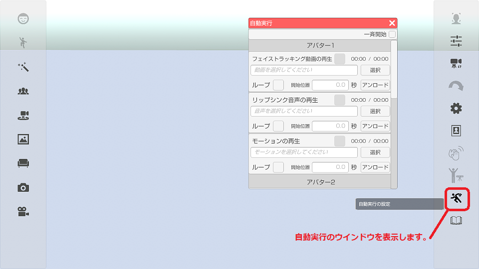

## 自動実行について

>下記の３種類に対応しています。

>MP4ファイルでフェイストラッキングを行う。
>Wavファイルでリップシンクを行う。
>BVHファイルでモーションを実行する。

### MP4ファイルでフェイストラッキング

>1. 3teneSTUDIO を起動してアバターを読み込む。
>2. アバターの調整 → 「設定」タブ → フェイストラッキングの種類を「動画ファイル」に変更。
>3. フェイストラッキングのプレビューウインドウを開いておく。（見ないなら不要）
>4. トラッキングウインドウを開いてファイストラッキングの「開始」を実行する。
>5. 右側メニューの下側にある自動実行アイコンでウインドウを開く。
>6. 選択ボタンで動画ファイルを選択する。
>7. フェイストラッキング動画の再生にチェックを付ける。（動画再生が開始されアバターが動きます。）

>※1 動画ファイルは MP4 (H.264) に対応しています。(AVI には対応していません。)
>※2 動画ファイルは「顔」が中心で顔がなるべく大きく映っている必要があります。
>　　顔の表示部分が小さいと目の開きの精度が落ち、まばたきが多くなります。
>※3 動画ファイルに含まれる音声は無視されます。

### Wavファイルでリップシンク

>1. 3teneSTUDIO を起動してアバターを読み込む。
>2. アバターの調整 → 「設定」タブ → リップシンク種類を「音声(ファイル)」に変更。
>4. トラッキングウインドウを開いてリップシンクの「開始」を実行する。
>5. 右側メニューの下側にある自動実行アイコンでウインドウを開く。
>6. 選択ボタンでWaveファイルを選択する。
>7. リップシンク音声の再生にチェックを付ける。（音声再生が開始されアバターが動きます。）

>※対応しているWaveファイルの仕様は下記になります。

>圧縮：無圧縮のリニアPCMのみ。
>サンプリング周波数： 22050 Hz 以上
>量子化ビット数： 16 bit のみ。
>チャンネル数： モノラル(1ch)、ステレオ(2ch)

### BVHファイルでモーション

>1. 3teneSTUDIO を起動してアバターを読み込む。
>2. 右側メニューの下側にある自動実行アイコンでウインドウを開く。
>3. 選択ボタンで BVH ファイルを選択する。
>4. モーションの再生にチェックを付ける。（アバターが動きます。）

>※ファイル選択後にアバターの調整で位置を変更した場合は
>　モーションをアンロードして再度選択し、再読み込みしてください。

