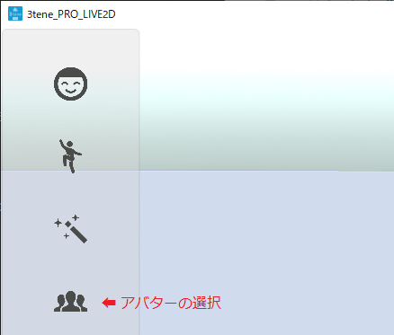
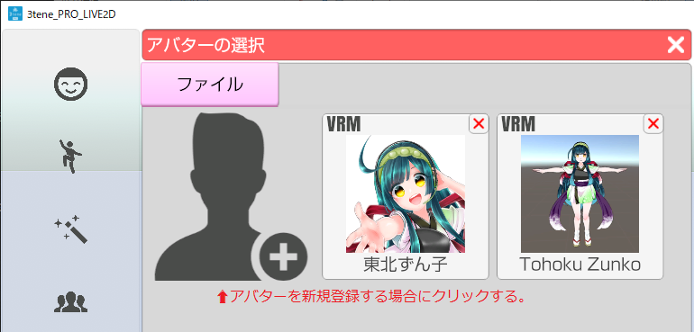
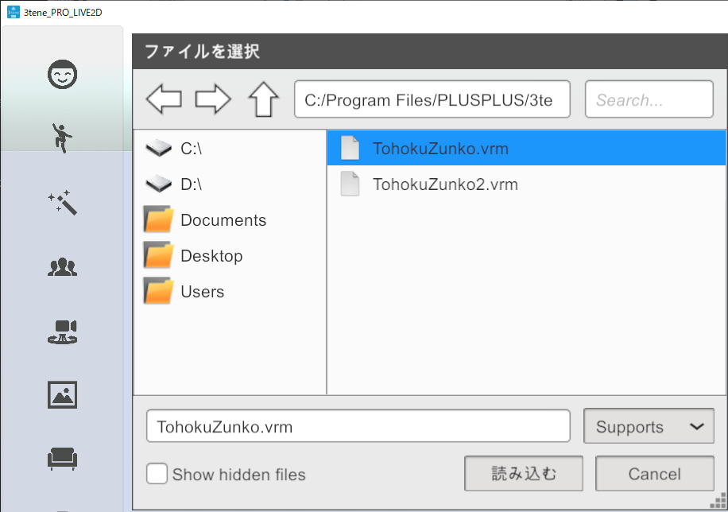

## アバターの読み込み

>アバターを読み込みます。
>１度読み込んだアバターは一覧に登録されます。

### アバターの選択ウインドウを表示する

>左側メニューの上から４番目をクリックします。

### アバターを新規登録する

>既に登録済みのアバターを使用する場合はそのアバターをクリックします。
>新規にアバター登録する場合は左上のアイコンをクリックします。

### ファイルを選択する

>読み込みたい VRM もしくは Live2D(json) を選択します。

