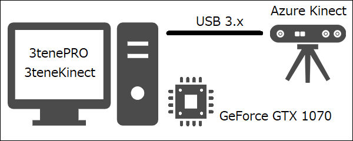
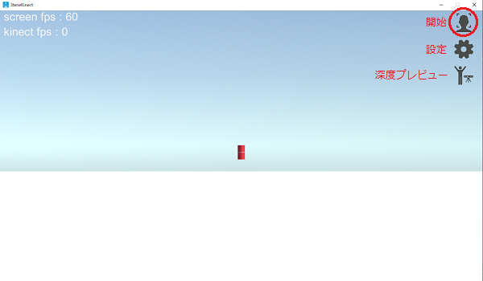
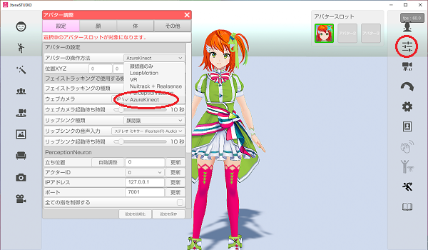
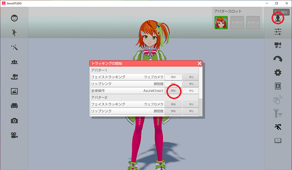
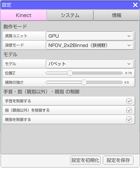
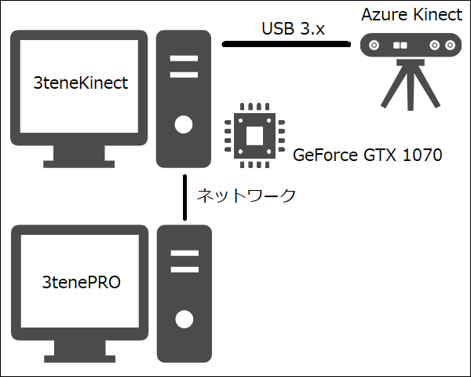
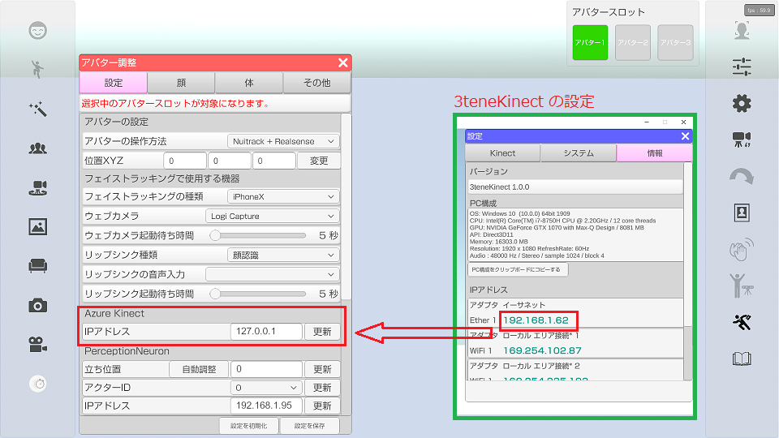

## Azure Kinect について

>深度カメラによってボディトラッキングを行います。

### Azure Kinect の要求スペック

>Azure Kinect でボディトラッキングを使用する為には高性能PCが必要になります。

>・ＣＰＵ：第7世代 Core i5 クアッドコア 2.4GHz 以上
>・メモリ：4GB 以上
>・ＧＰＵ：NVIDIA GeForce GTX 1070 以上
>・接続：USB 3.x 必須。（USB 2.0 では Kinect を認識しません。）

>Azure Kinect は CUDA を使用するので NVIDIA 製 GeForce シリーズが必須となります。
>Intel の ＣＰＵ内蔵グラフィック、および AMD 製の Radeon シリーズには対応していません。

><a href="https://docs.microsoft.com/ja-jp/azure/kinect-dk/system-requirements" target="_blank">公式：Azure Kinect 要求機能（英語）</a>

>「Visual Studio 2015 の Visual C++ 再頒布可能パッケージ」のインストールが別途必要です。
><a href="https://docs.microsoft.com/ja-jp/azure/kinect-dk/body-sdk-setup" target="_blank">公式：開発者向けクイックスタート</a>

### 注意事項

>・黒い衣服を着ていると認識率が低下します。
>・現在のバージョンは複数人の認識に対応していません。（必ず１人だけ写るようにしてください。）

### 3teneKinect について

>3tene(PRO, STUDIO) で Azure Kinect を使用する為には
>別途 3teneKinect が起動している必要があります。

>3teneKinect が Azure Kinect の制御を行い、
>その認識結果を 3tene 側で受け取り、アバターに動きを反映させます。

>3teneKinect は AzureKinect DK の Sensor-SDK 1.3.0、 BodyTracking-SDK 1.0.1 を使用して
>作成されています。
>認識する部位は頭、腕、手、腰、足となりますが指は親指と人差し指のみとなります。
>指の認識ではブレが発生しやすい為、3teneKinect では指の制御機能を用意しています。

>3teneKinect は 3tenePRO のダウンロードと同じく、
><a href="https://www.3tene.com" target="_blank">3tene 公式サイト</a>のマイページよりダウンロードできます。

>PC 1台で構成する場合は下記になります。
>

### Azure Kinect の操作手順

>1. 3tene を起動する。
>2. 3teneKinect を起動する。
>3. 3teneKinect で Azure Kinect の制御を開始する。
>
>4. 3tene でボディトラッキングを Azure Kinect に設定します。
>
>5. 3tene のトラッキングを開始します。
>

>必ず 3teneKinect の制御を開始した後に 3tene のトラッキング開始を行ってください。

### 3teneKinect の設定項目

>

>#### 演算ユニット
>GPU ： 認識処理にグラフィックボード（GPU）を使用します。
>CPU ： 認識処理にＣＰＵを使用します。（処理が重すぎて速度がほぼ出ません。）

>#### 深度モード
>NFOV 2x2 Binned ： 奥行き重視。75度、0.5～5.46m、最大30fps
>NFOV Unbinned ： 奥行き重視。75度、0.5～3.86m、最大30fps、高解像度
>WFOV 2x2 Binned ： 広さ重視。120度、0.25～2.88m、最大30fps
>WFOV Unbinned ： 広さ重視。120度、0.25～2.21m、最大15fps、高解像度

>#### モデル
>パペット ： 認識結果をパペットに反映させます。認識結果をそのまま反映します。
>みとね ： VRM モデルに認識結果を反映させます。3teneで表示させた場合の確認用です。
>両方 ： パペットと VRM モデルを表示します。

>#### 位置Ｚ
>モデルの位置を調整します。

>#### 補間の強さ
>認識結果に対して補間を行います。強めにすると細かいブレが抑えられます。

>#### 手首を制御する
>手首に認識結果を反映するかを指定します。
>手首のブレが激しい場合にはオフにしてください。（手首は動かなくなります。）

>#### 指（親指以外）を制御する
>指に認識結果を反映するかを指定します。
>指のブレが激しい場合にはオフにしてください。（指は動かなくなります。）

>#### 親指を制御する
>親指に認識結果を反映するかを指定します。
>親指のブレが激しい場合にはオフにしてください。（親指は動かなくなります。）

### PCを2台以上の構成で扱う

>3tene(PRO, STUDIO) と 3teneKinect を別々のPCで動かして利用する事が可能です。
>Azure Kinect 用の高性能 PC を別途用意する事で負荷分散も行えます。
>※β版で分散機能は提供されません。

>

>3teneKinect の IP アドレスを確認して 3tene 側の AzureKinect の IPアドレスに設定します。
>※１台構成に戻す場合は IPアドレスを 127.0.0.1 に設定してください。

>

>※セキュリティソフトのファイアウォールによって
>　3teneKinect の通信がブロックされる場合があります。
>　ブロックされると接続ができないのでセキュリティの設定変更が必要です。

>ファイアウォールを完全無効にして接続を確認する事も可能ですが、
>セキュリティ上、大きな問題となる為、接続確認が取れた場合は
>速やかにファイアウォールの設定を戻してください。
>通常使用ではセキュリティソフトに「3teneKinect をブロックしない設定」を追加してください。

>後は１台構成の場合と同じ手順で 3teneKinect の制御を開始した後に、
>3tene のトラッキングを開始します。

