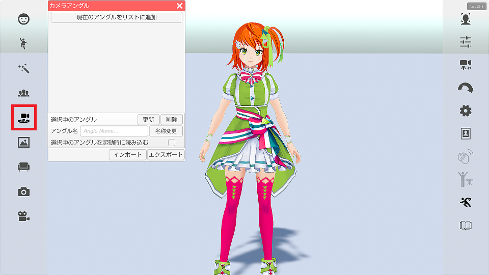
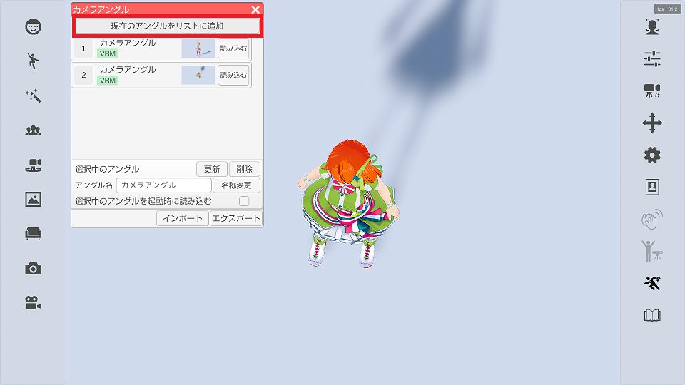
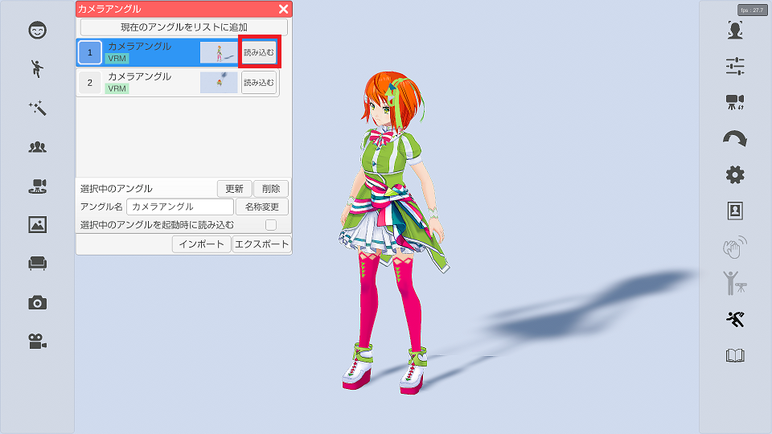
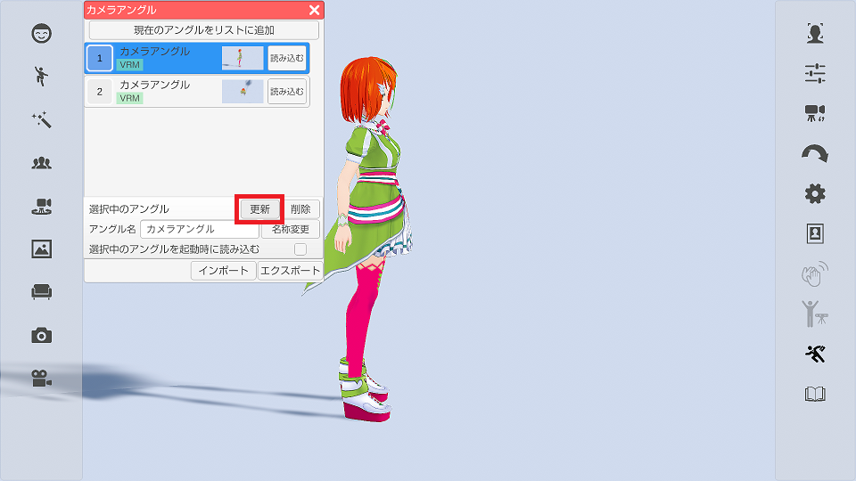
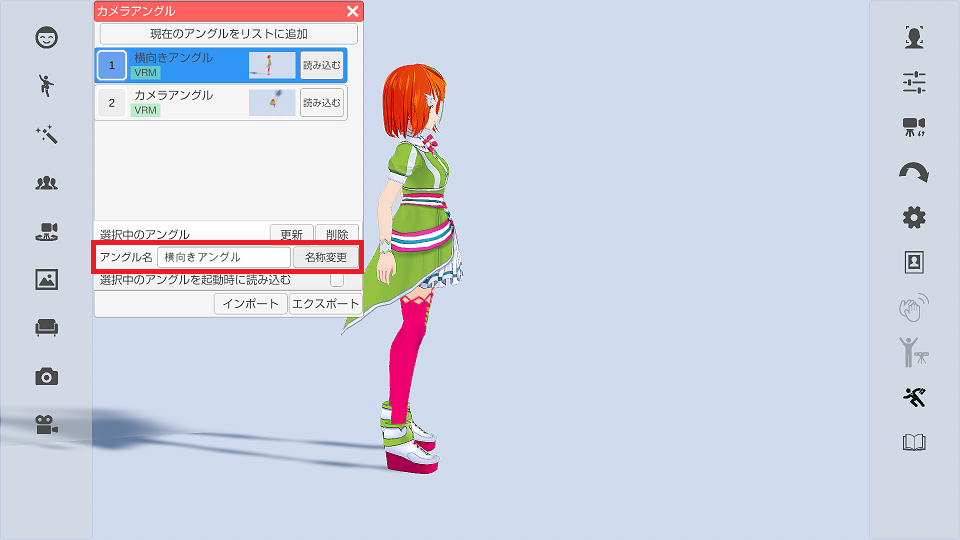

## シーンカメラのアングルについて

>シーンカメラのアングルを保存および復帰を行います。

>※VRM 読み込み時に保存したアングルは Live2D 読み込み時には利用できません。
>　（逆も出来ません。）

### シーンカメラのアングルのウインドウを表示する

>左側メニューの５番目のシーンカメラのアングルをクリックします。

### アングルの保存

>「現在のアングルをリストに追加」を選択すると
>現在のシーンカメラの状態が保存され、リストに追加されます。

### アングルの復帰

>リストに登録されているアングルの「読み込む」を選択すると
>保存されているアングルが復帰します。

### アングルの更新、削除

>保存済みのアングルを変更する場合は変更したいアングルを選び（青色状態にする）、
>リスト下の「更新」ボタンを選択します。

>保存済みのアングルを削除する場合は変更したいアングルを選び（青色状態にする）、
>リスト下の「削除」ボタンを選択します。

### アングル名称の変更

>保存済みのアングルの名称を変更する場合は変更したい
>アングルを選び（青色状態にする）、アングル名を編集した後に
>「名称変更」ボタンを選択するとリストの表示名称が変更されます。

### 起動時に保存したアングルを復帰させる

>起動時に復帰させたいをアングルを選び（青色状態にする）、
>「選択中のアングルを起動時に読み込む」のチェックを付けると
>次回、3tene 起動時に保存されたアングルが自動的に復帰されます。

### アングルのインポート、エクスポート

>保存したシーンカメラのアングルをバックアップしたい場合や、
>他の PC にインストールされた 3tene に移したい場合に使います。

>エクスポートでシーンカメラのリストとそれに関連する画像を
>指定されたフォルダに CameraAngle フォルダとして出力します。

>インポートではエクスポートで出力されたフォルダを指定する事で
>保存された情報を取り込みます。

>※インポートするとそれまでのリスト情報は全て破棄されるので
>　使用する場合は注意して使用してください。

