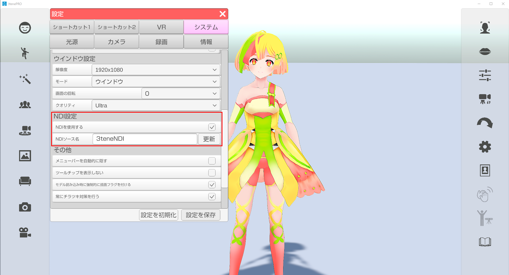
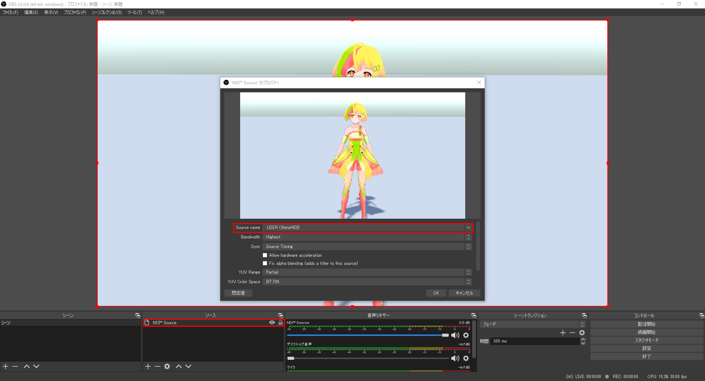

## NDIについて

>NDI（開発元：米国NewTek社）に対応し、ローカルエリアネットワークでの高機能映像配信に対応。
>他社製アプリとの競合回避、複数のPCへ同時配信、複数のPCのキャラクター合成などにご利用可能です。

>この機能を利用するには、NDIの受信ソフトが必要になります。
>OBSではNDIのプラグインをインストールする必要があります。
>※ Win版、Mac版で動作確認済み

>NDI を使用して送信される3teneの映像はメニューやウインドウが
>録画対象とならないのでアバターと背景のみが録画可能になります。

### 3tene内の設定

>下記サイトを開きます。

>設定 - システム - 「NDIを使用する」 にチェックを入れると3teneの設定は完了です。
>設定 - システム - 「NDIソース名」 で受信側にソースが表示されます。
>NDIソース名 は変更することが出来ます。デフォルトでは「3teneNDI」となっております。

>受信側でソース名を3tene内で設定したソース名を選択すると映像が出力されます。

### OBS での使用方法

>OBS のプラグインである obs-ndi をインストールします。
>※ Windows用、Mac用があります。
>https://github.com/Palakis/obs-ndi/releases
 
>インストールが完了するとソースに「NDI Source」が追加されます。
>NDI Source を追加し、「Source name」 に 3tene で設定した「NDIソース名」を選択し、右下の「OK」をクリックすると 3tene 画面が表示されます。

