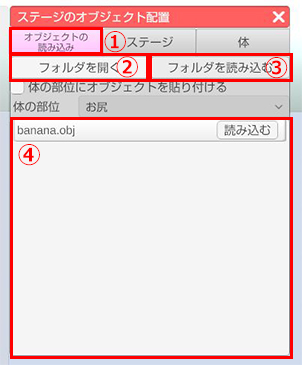
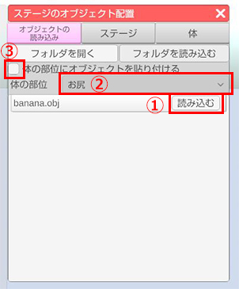
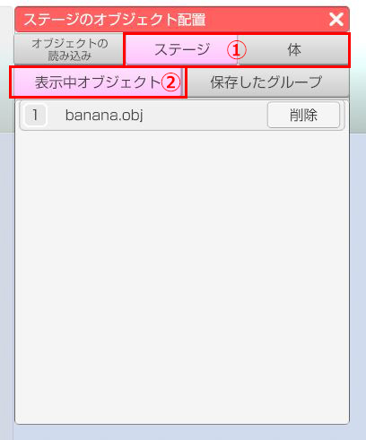
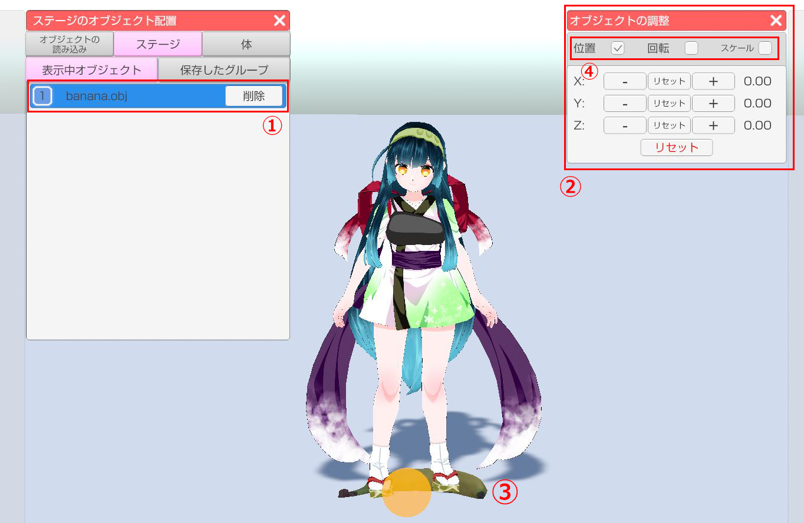
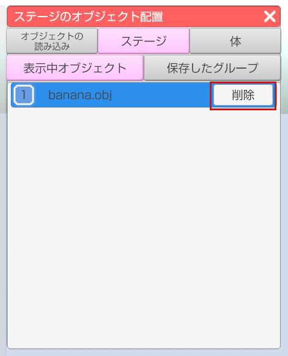

## オブジェクトの読み込みについて
>3tene のシーンに外部から取り込んだ3Dオブジェクト(以下オブジェクト)を配置します。
>OBJファイル、FBXファイルの読み込みに対応しています。
>※OBJファイルがMTLファイル、テクスチャ画像を参照する場合はファイルを全て含めてください。

### ステージのオブジェクト配置ウインドウを表示する

>左側メニュー上から7番目をクリックします。

### オブジェクトファイルを読み込み用フォルダに置く

>上部タブの「オブジェクトの読み込み」の「フォルダを開く」をクリックします。 画像①, ②
>エクスプローラーが立ち上がるので、読み込みたいオブジェクトファイルを開いたオブジェクトフォルダに移動させます。
>3tene画面に戻り「フォルダを読み込む」をクリックします。 画像③, ④
>オブジェクトフォルダ内のオブジェクトファイルが3teneに読み込まれ、同タブ内にオブジェクトのリストが表示されます。 画像⑤

### 3teneのステージ上にオブジェクトファイルを表示する

>表示されたリストの「読み込む」をクリックするとステージ上にオブジェクトが表示されます。 画像上①
>「体の部位にオブジェクトを張り付ける」にチェックを入れ、「体の部位」のドロップダウンからオブジェクトを貼り付けたい部位を選択してから、上記同様リストの「読み込む」をクリックすると選択した部位にオブジェクトを張り付けることが出来ます。 画像上②, ③
>また、上部タブの「表示中オブジェクト」タブ内にリストとして追加されます。 画像下

### オブジェクトの調整

>上部タブの「表示中オブジェクト」内の該当のリストをクリックすると色がリスト背景が青に変化し同オブジェクトのオブジェクトの調整ウィンドウが表示されます。 画像①, 画像②
>また、選択中のオブジェクトにオレンジのポイントが表示されます。 画像③
>オブジェクトの調整ウィンドウ上部の位置、回転、スケールの調整したいもののチェックボックスにチェックを入れるとそれぞれを調整することが出来ます。 画像④

>下記画像は位置、回転、スケールのウィンドウになります。
>「+」「-」ボタン（長押し可能）をクリックする事で値を変更します。
>「+」「-」の間のリセットボタンをクリックすると該当する軸の値を初期値に戻します。
>下部のリセットボタンをクリックすると全ての軸の値を初期値に戻します。（オブジェクトを読み込んだ時の状態）
>※スケールについては「All」のリセットで全ての軸を初期値に戻します。

### オブジェクトの削除

>上部タブの「表示中オブジェクト」内のリストの右側の「削除」をクリックすると該当のオブジェクトを削除します。

### 既知の不具合

>3teneのオブジェクトの読み込み機能でOBJファイル、FBXファイルであってもオブジェクトを読み込めない場合がございます。こちらにつきましては検証中となっております。予めご了承ください。
