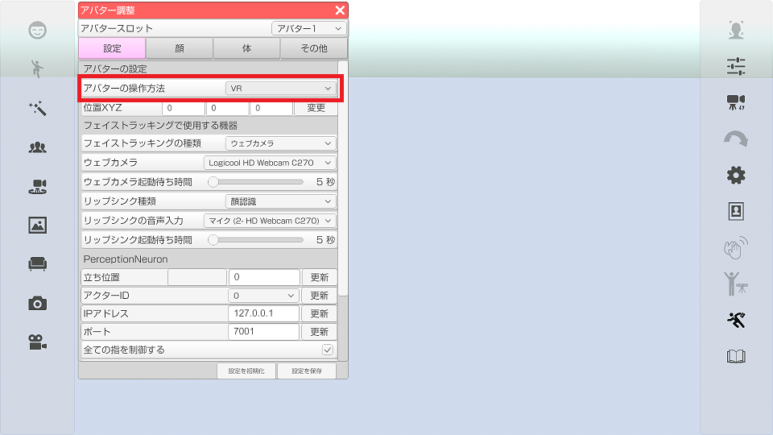
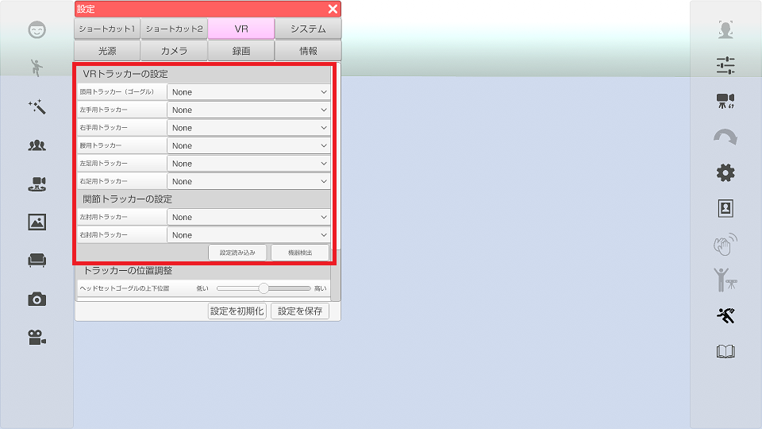
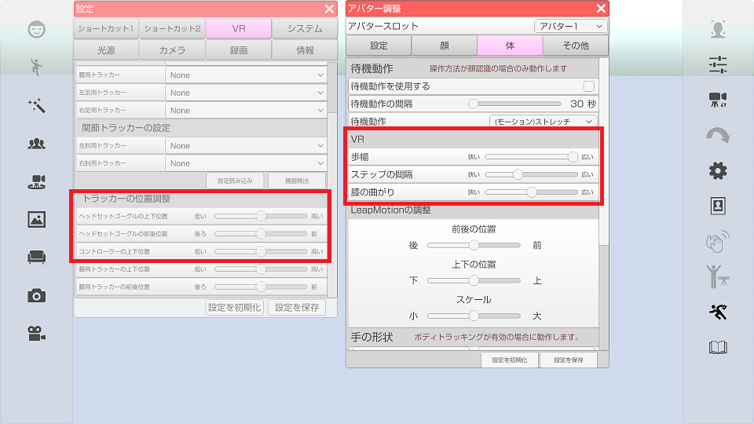
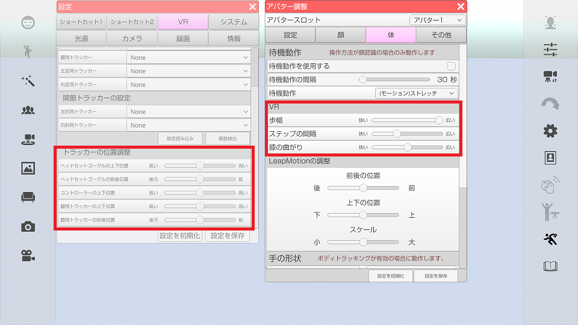
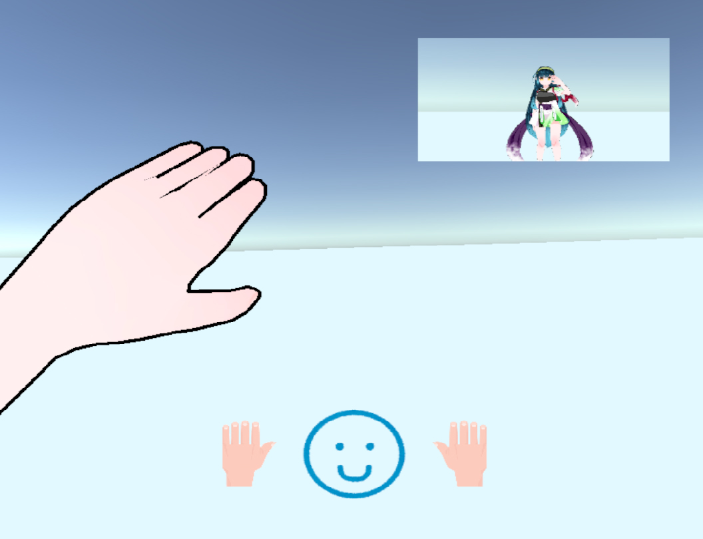

## VRモードの使い方

>HTC Vive や Oculus Rift を使用してアバターを操作します。

### VRモードの設定

>アバターの調整でアバターの操作方法を「VR」に変更します。

### VRヘッドセット、コントローラ、トラッカーの認識

>設定のVRタブでトラッカーの認識状態の確認および部位の割り当てを行います。

### ヘッドセット + コントローラー2本で操作する（トラッカー無しの場合）

>VR装着者がＴポーズをとり、左右コントローラどちらかのメニューボタンを押すと
>キャリブレーションが行われます。

>その後、設定「VR」タブのトラッカーの位置調整からモデルの大きさに合わせてそれぞれを調整します。
>アバターを調整 から 歩幅、ステップの間隔、膝の曲がり をそれぞれを調整します。
>・歩幅：足の幅
>・ステップの間隔：ヘッドセットの位置への足の追従の大きさ
>・膝の曲がり：膝を曲げた際の曲がり具合（内股、ガニ股）

### ヘッドセット + コントローラー2本 + トラッカー1～3個で操作する

>VR装着者がＴポーズをとり、左右コントローラどちらかのメニューボタンを押すと
>キャリブレーションが行われます。

>設定「VR」タブのトラッカーの位置調整で下記の設定を行います。
>腰用トラッカーの上下、前後を調整します。
>ヘッドセットゴーグルの前後位置 からヘッドセットの位置を調整します。
>アバターを調整 から 膝の曲がり を調整します。
>・膝の曲がり：膝を曲げた際の曲がり具合（内股、ガニ股）を調整します。

### ヘッドセット内の画面

>VRヘッドセット内の下側のアイコンはそれぞれ 左手 , 表情 , 右手 の現在の状態です。
>右上の映像はPCに表示されている映像（録画する事が出来る映像）になります。

### 操作方法

>コントローラーのタッチパッドまたはスティックで手の形を変更可能です。
>右コントローラー：上-自然体 下-握る 左-人差し指 右-ピース
>左コントローラー：上-自然体 下-握る 左-ピース 右-人差し指

>コントローラーのトリガーを引いた状態でタッチパッドまたはスティックを操作すると
>表情の変更が可能です。
>上-平穏 下-喜び 左-怒り 右-悲しい

