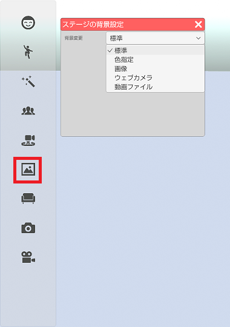
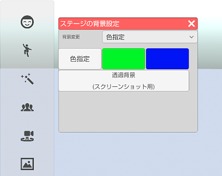
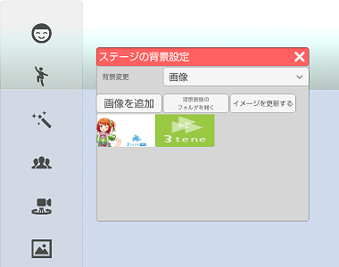
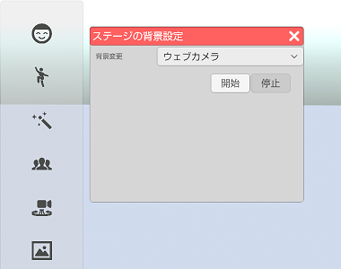
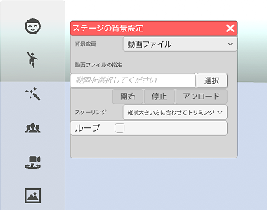

## 背景変更について

>背景表示を変更します。

### 背景変更のウインドウを表示する

>左側メニューの６番目の背景変更をクリックします。

>ドロップダウンから変更したい背景の種類を選択します。

>#### 標準

>背景を変更していない状態です。
>背景を元に戻す場合はドロップダウンメニューで「標準」を選択してください。

>#### 色指定

>背景を単色で塗りつぶします。
>・色指定 → 好きな色を選択して背景に設定します。
>・緑色 → 背景を全て緑色で塗りつぶします。
>・青色 → 背景を全て青色で塗りつぶします。
>・透過色 → スクリーンショットで画面を保存した場合に背景αがゼロで保存されます。
>　※動画保存に背景αの変更は適用されません。

>背景を元に戻す場合はドロップダウンメニューで「標準」を選択してください。

>#### 画像

>画像ファイルを背景に設定します。
>対応している画像ファイルは PNG、JPEG となります。

>「画像を追加」ボタンで画像ファイルをリストに登録します。
>リストに登録された画像を選択すると背景に設定されます。

>複数の画像ファイルを登録したい場合「背景画像のフォルダを開く」で
>表示されるフォルダに画像ファイルを置いた後に「更新する」を選択してください。
>画像ファイルの登録を解除したい場合も「背景画像のフォルダを開く」で
>表示されるフォルダの画像ファイルを削除後、「更新する」を選択してください。

>背景を元に戻す場合はドロップダウンメニューで「標準」を選択してください。

>#### ウェブカメラ (3teneFREE は非対応)

>ウェブカメラの映像を背景に表示します。

>使用するウェブカメラは設定の「システム」タブで変更します。
>１つのウェブカメラでフェイストラッキングと同時使用する事はできません。
>複数のウェブカメラを使用する場合はウェブカメラの販売メーカーから
>提供される専用ソフトウェア(ドライバ)が必要になります。

>背景を元に戻す場合はドロップダウンメニューで「標準」を選択してください。

>#### 動画ファイル (3teneSTUDIO のみ)

>動画ファイルを背景に設定します。
>対応している動画ファイルは MP4 (H264) となります。
>音声は再生されません。

>動画ファイルを選択した直後にメモリ上に読み込まれます。
>ファイルもロックされますので使用しない場合は「アンロード」で解放してください。

