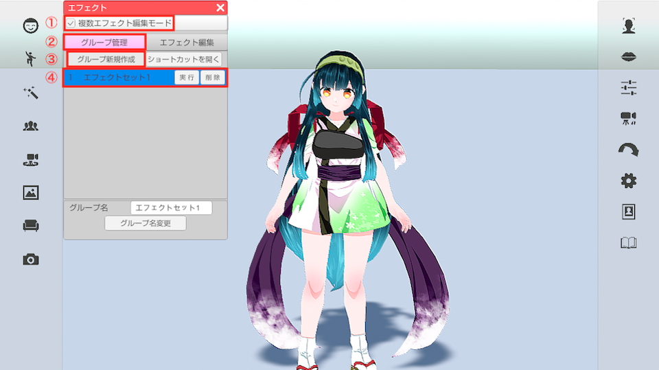
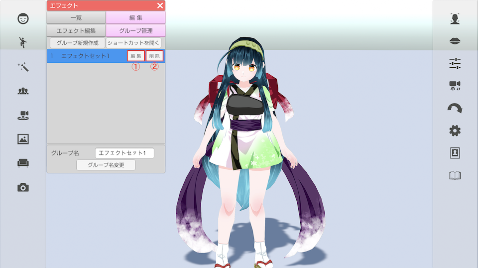
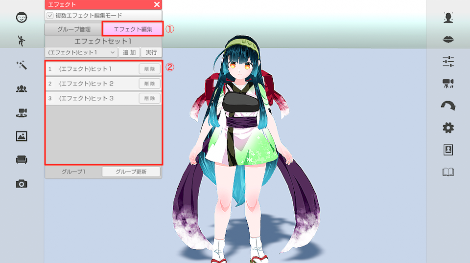
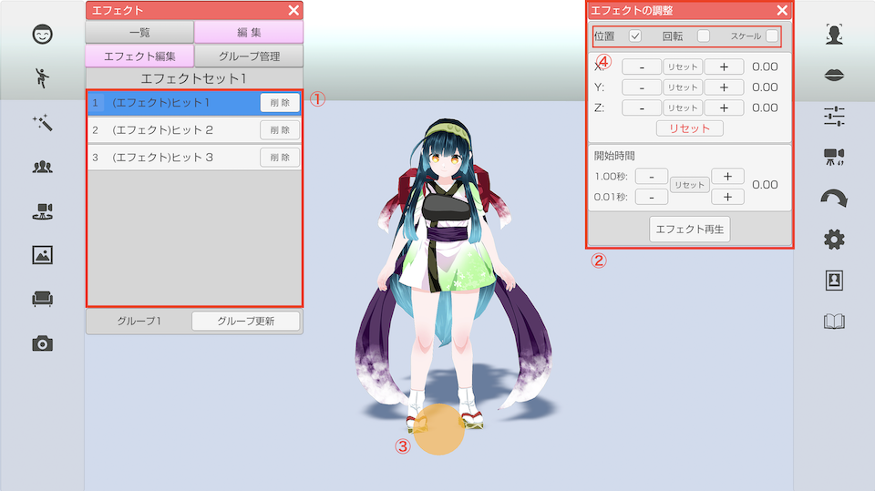
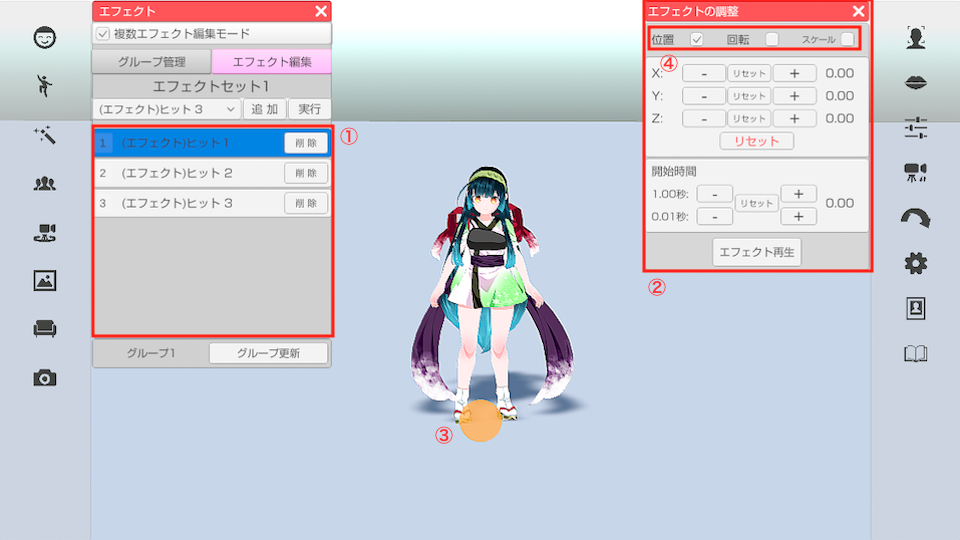
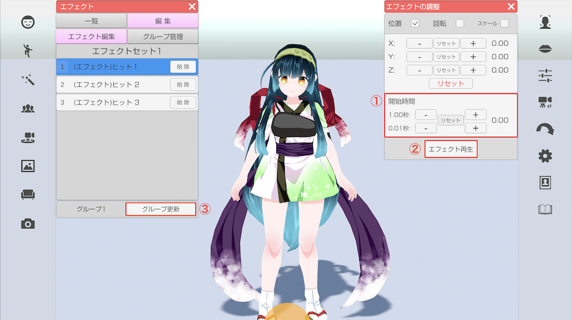
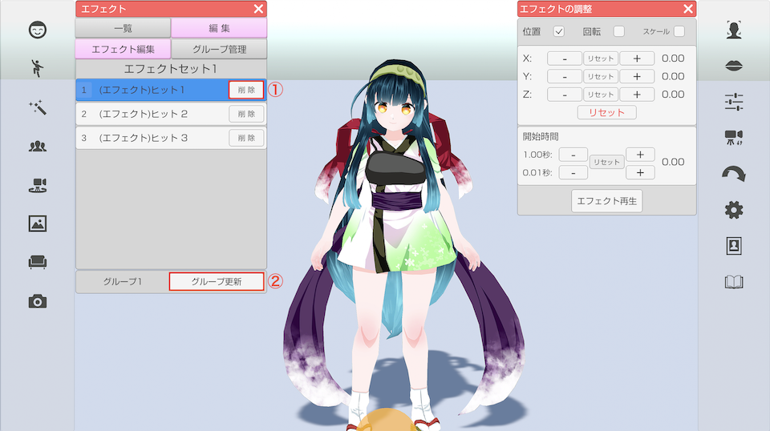
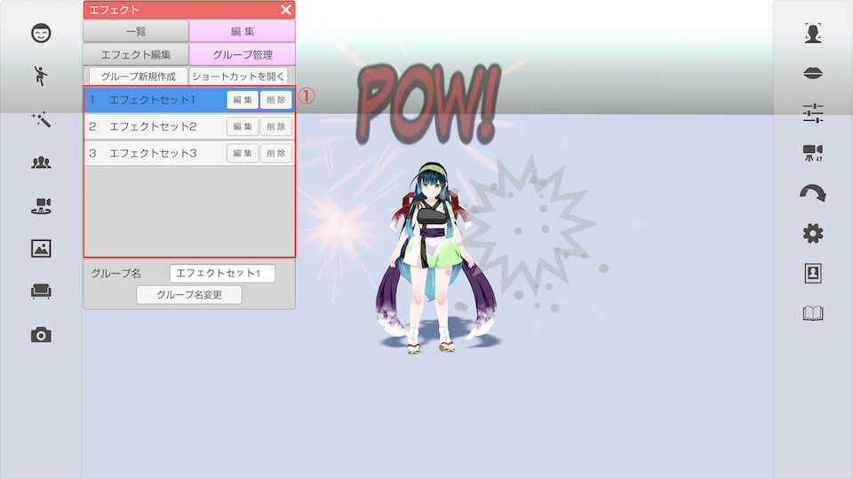
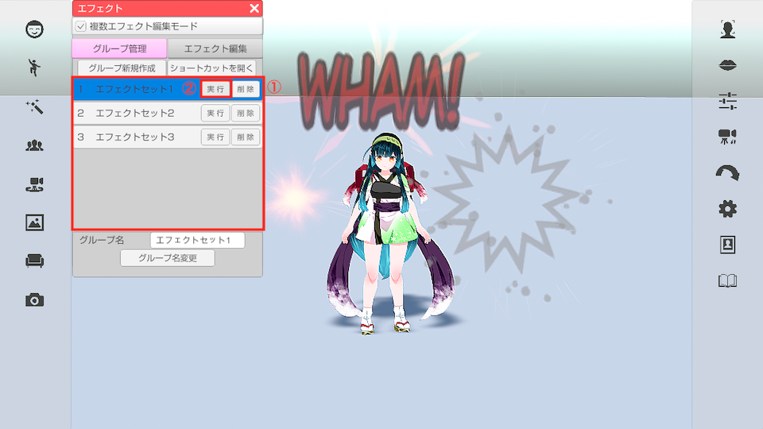

## エフェクトについて

>エフェクトを表示する事が可能です。

### エフェクトのウインドウを表示する

>左側メニューの３番目のエフェクトをクリックします。

### エフェクトを実行する

>上部タブ「一覧」内のリストから実行したいエフェクトを選択すると
>画面にエフェクトが表示されます。

### ショートカットに割り当てる

>「ショートカットを開く」をクリックすると
>設定ウインドウの「ショートカット」タブが表示されるので
>実行したいエフェクトにキーボードやゲームパッドを割り当ててください。

***

## エフェクトグループについて

>グループを作成して複数のエフェクトを組み合わせて表示することができます。
>また、グループ内の各エフェクトの位置・回転・スケール・開始時間を設定することができます。

### グループを作成する

>上部タブ「編集」をクリックします。画像①
>「グループ管理」をクリックするとグループの管理画面が表示されます。画像②
>「グループ新規作成」をクリックすると新しいグループ『エフェクトセット1』が作成されます。画像③, ④
>(保存中のグループの数によって初期名称の数字が変わります)
>グループが作成されると自動的に選択状態(背景青色)となります。

### 編集するグループを選択する・削除する

>上部タブ「編集」-「グループ管理」をクリックしてグループ管理画面を開きます。
>「グループ管理」内のリスト右側の「編集」をクリックすると該当のグループを選択することができます。(選択されているグループの背景は青色になります) 画像①
>グループが選択されると自動的にエフェクト編集画面が表示され、グループに保存されているエフェクトの一覧が表示されます。
>
>「グループ管理」内のリストの右側の「削除」をクリックすると該当のグループを削除します。画像②

### グループにエフェクトを追加する

>上部タブ「一覧」をクリックします。
>「一覧」内のリストの右にある「追加」をクリックすることで、グループにエフェクトが追加されます。
>(グループが選択状態の時はそのグループに、未選択状態の時は新しいグループが自動で作成され新しいグループに追加されます)
>エフェクトが追加されると自動的にエフェクト編集画面が表示されます。

### グループのエフェクトを編集する

>
>グループが選択された状態で上部タブ「編集」「エフェクト編集」をクリックしてエフェクト編集画面を表示します。
>「エフェクト編集」内のリストをクリックすると該当のリスト背景が青色に変化し同エフェクトのエフェクトの調整ウィンドウが表示されます。画像①, ②
>(リストがない場合は「一覧」からエフェクトを追加してください)
>
>また、選択中のエフェクトにオレンジのポイントが表示されます。画像③
>エフェクトの調整ウィンドウ上部の位置、回転、スケールの調整したいもののチェックボックスにチェックを入れるとそれぞれを調整することが出来ます。画像④

>下記画像は位置、回転、スケールのウィンドウになります。
>「+」「-」ボタン（長押し可能）をクリックする事で値を変更します。
>「+」「-」の間のリセットボタンをクリックすると該当する軸の値を初期値に戻します。
>下部のリセットボタンをクリックすると全ての軸の値を初期値に戻します。（オブジェクトを読み込んだ時の状態）
>※スケールについては「All」のリセットで全ての軸を初期値に戻します。

>エフェクトの調整ウィンドウの下部に開始時間の設定項目があります。画像①
>「+」「-」ボタン（長押し可能）をクリックする事で開始時間の値を変更します。
>1秒ずつ、または0.01秒ずつ変更できます。
>「+」「-」の間のリセットボタンをクリックすると開始時間の値を初期値に戻します。
>
>「エフェクト再生」をクリックすると編集中のエフェクトを発生させて確認することができます。画像②
>編集が完了したら「グループ更新」をクリックして選択中のグループを更新します。画像③

### グループのエフェクトを削除する

>グループが選択された状態で上部タブ「編集」「エフェクト編集」をクリックしてエフェクト編集画面を表示します。
>「エフェクト編集」内のリストの右の「削除」をクリックすると該当のエフェクトが削除されます。画像①
>「グループを更新」をクリックして選択中のグループを更新します。画像②

### グループを再生する

>上部タブ「編集」「グループ管理」をクリックしてグループ管理画面を表示します。
>「グループ管理」内のリストをクリックするとグループを再生することができます。画像①

### グループの名前を変える

>上部タブ「編集」「グループ管理』をクリックしてグループ管理画面を開きます。
>「グループ管理』内のリストから、名前を変更したいグループの「編集」をクリックして選択状態にします。画像①
>ウィンドウ下側にあるグループ名のテキストを変更し、「グループ名変更」をクリックするとグループの名称を変更できます。画像②, ③

***

## グループのショートカットについて

>上部タブ「編集」-「グループ管理」内のグループのリストの上から５つのグループはショートカット機能が使えます。
>上部タブ「一覧」内、または「編集」-「グループ管理」内の「ショートカットを開く」をクリックするとショートカット設定ウインドウが開きます。
>※3tene右側メニュー上から6番目の「設定」アイコンからも開くことが出来ます。
>ショートカットリストの中の「エフェクトグループ1」〜「エフェクトグループ5」にショートカットキーを設定することが出来ます。
