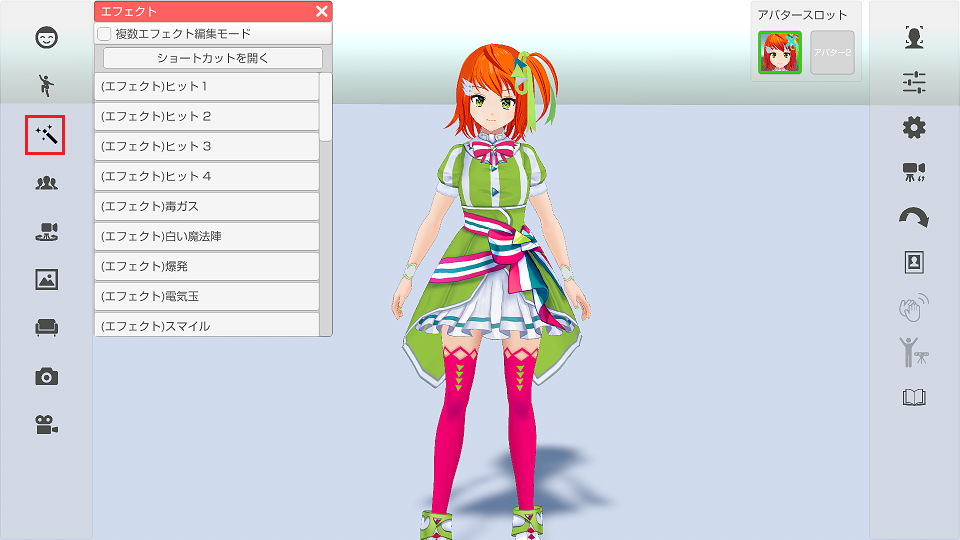

## エフェクトについて

>エフェクトを表示する事が可能です。

### エフェクトのウインドウを表示する

>左側メニューの３番目のエフェクトをクリックします。

### エフェクトを実行する

>リストから実行したいエフェクトを選択すると
>画面にエフェクトが表示されます。

### ショートカットに割り当てる

>「ショートカットを開く」を選択すると
>設定ウインドウの「ショートカット」タブが表示されるので
>実行したいエフェクトにキーボードやゲームパッドを割り当ててください。

