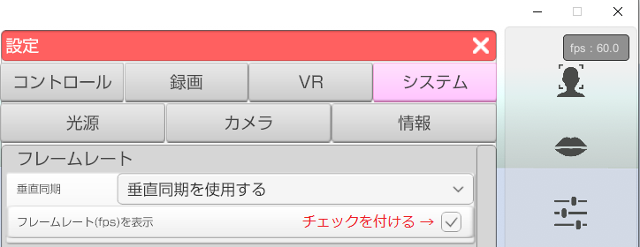

## FAQ

### 3tene を動かす為に必要なグラフィック機能は？

>Windows であれば DirectX 11 対応のグラフィック機能が必要となります。
>DirectX 9Ex でも動作するようですが処理落ちや表示崩れが発生します。
>Mac は Metal に対応していれば動作します。
>※Mac 2012年製品でも動作するようですがサポート対象外です。

### 3tene を利用する為に必要な機材はありますか？

>特別な機材が無くてもキーボードとマウスでモデル操作は可能ですが、
>自然な動作をさせるにはウェブカメラやVR機器が必要になります。

>対応している機材については[こちら](#equipment.md)を参照してください。

### どんなウェブカメラを使えばいいですか？

>30fps 以上に対応したウェブカメラが必要です。
>古いウェブカメラでも動作しますが 10fps 程度しか映像更新ができず、
>フェイストラッキングがスムーズに動作しない場合があります。

### VR でゴーグルを使わずに利用する事は可能ですか？

>HTC Vive で頭にトラッカーを割り当てれば可能です。
>ただし、ゴーグルを使わない場合でもゴーグルを接続して認識させている必要があります。

### 3teneSTUDIO で同じアバターを複数表示する事は可能ですか？

>保存ファイル名を変更して出力した VRM ファイルを複数用意する事で可能です。
>コピーで VRM ファイルを複製すると同じアバターと認識する為、複数表示はできません。

### 全体的に動きが遅いです。

>使用しているパソコンの処理速度が遅い可能性があります。
>3tene では2014年以降のパソコン (Core i5 4000 番台以降) が対象となります。

>フレームレート(画面の更新回数)を表示させて処理速度の確認が可能です。

>下記の操作でフレームレートを表示させます。
>3tene の設定 → システム → フレームレート(fps)の表示
>にチェックを付けてください。

>画面右上にフレームレートが表示されます。
>フレームレートの値が 50～60fps をキープ出来ない場合は
>処理性能が足りていません。

### 再生中の音でリップシンクを動作させる事は可能ですか？

>録音機器に「ステレオ ミキサー(Stereo Mixer)」を指定してください。
>使用しているPCによってはステレオミキサーが無い場合もあります。

>※録音機器のデバイスドライバを最新バージョンに更新すると
>　「ステレオ ミキサー」が使えるようになる場合もあります。
>　ただし、デバイスドライバの更新は自己責任でお願いします。

### 3tene のウインドウが非アクティブの状態でキーボード操作は可能ですか？

>Windows の仕様に依存する部分でもあり対応は難しいです。

>キーボードでは不可能ですが代わりに MIDI 機器を使えば
>ウインドウが非アクティブ状態でもショートカット機能が動作します。

### 同封されている東北ずん子(VRM)の利用に制限はありますか？

>クリエイターは非商用なら利用可能です。
>東北企業であれば無料で利用可能ですが、他県の企業は申請が必要です。

>詳しくは[公式サイト](https://zunko.jp/guideline.html)を参照してください。

### 同封されているみとね(Live2D)の利用に制限はありますか？

>3teneの公式マスコット「みとね」は
>個人、法人、商用の有無に関わらず自由に利用できます。

>ただし、法令及び公序良俗に反するもの、キャラクターのイメージを損なうもの、
>特定の個人、政党、宗教団体を支援するものや
>上記に該当するおそれがあるものには利用できません。

### 同封されている友利ユナ(Live2D)の利用に制限はありますか？

>自己責任のもと、動画投稿・生配信用のアバターとして使用する事が可能です。

>詳しくは「JK_Tomori_yunaフォルダ」の「最初にお読み下さい_取扱説明書.txt」を参照してください。

### 最初から同封されているモデルはどこにありますか？

>東北ずん子(VRM)、みとね＆友利ユナ(Live2D版のみ同封)は下記のフォルダにあります。

>Windows
>C:\Program Files\PLUSPLUS\3tenePro+Live2D\3tene_Data\StreamingAssets\2Dmodel
>C:\Program Files\PLUSPLUS\3tenePro+Live2D\3tene_Data\StreamingAssets\3Dmodel

>Mac
>/StreamingAssets/2Dmodel
>/StreamingAssets/3Dmodel

### 3tene を使って作成した動画に利用制限はありますか？

>基本的にはありません。
>配布および配信を自由に行う事ができます。
>ただし、商用利用の動画を作成する場合は個人、法人を問わず 3tenePRO の購入をお願いします。
>上記に該当しない場合は利用方法を[お問い合わせ](https://3tene.com/contact/)ください。

### 個人事業主ですがフリー版は利用可能ですか？

>業務内容（請負、納品方法等）によって異なる場合があるので
>利用方法を[お問い合わせ](https://3tene.com/contact/)ください。

### 法人でもフリー版は利用可能ですか？

>法人でのご利用の場合は [3tenePRO もしくは 3tenePRO+Live2D](https://3tene.com/pro_company/) のご購入をお願い致します。
>3tenePRO のご購入前に動作確認のみを目的としてフリー版を使用するのは問題ありません。

### 教育機関でもフリー版は利用可能ですか？

>使用者が生徒であり、報酬を得ない場合は利用可能です。
>作成した動画の動画サイトへのアップロードも問題ありません。
>上記に該当しない場合は利用方法を[お問い合わせ](https://3tene.com/contact/)ください。

