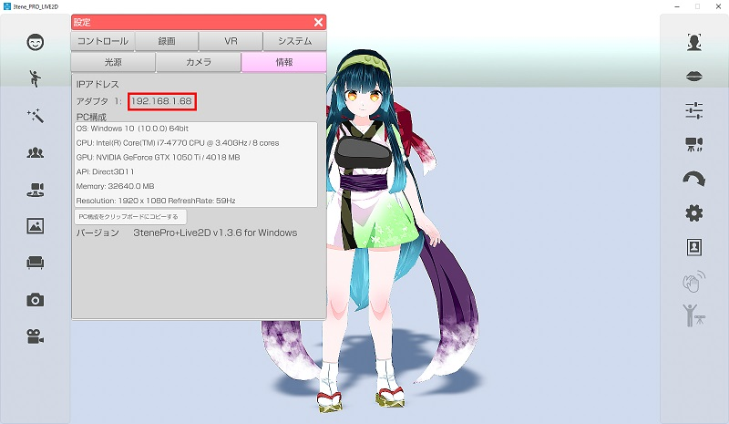
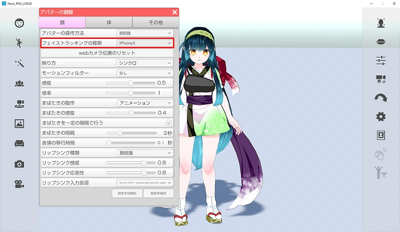

## iPhoneX フェイストラッキングについて

>iPhoneX 以降にフェイストラッキング アプリ 3teneFT をインストールする事で
>高精度のフェイストラッキング、アイトラッキングが 3tenePro で利用できます。

>また、iPhoneX の高精度のフェイストラッキングを利用することにより、
>左右別々でのまばたきも可能になっています。

### iPhone 用アプリ「3teneFT」のインストール

>上記リンクまたは App Store で 3teneFT を検索してインストールをしてください。

### 3tenePro と 3teneFT のネットワークについて

>3tenePro と 3teneFT を接続するには iPhone を WiFi に切り替える必要があります。
>キャリア通信(docomo、au、SoftBank)のインターネット経由では接続ができません。

>PC とルーターを接続し、そのルーターの WiFi に iPhone を接続してください。
>※3teneFT を利用する iPhone を PC と同じネットワークに接続する必要があります。

>また、 PC のセキュリティソフトのファイアーウォールが有効の場合に
>3tenePro と 3teneFT の接続がブロックされる事があります。
>使用しているセキュリティソフトのファイアウォール設定を変更し、
>3tenePro または 3tenePro+Live2D の通信の許可や、ブロック解除を行ってください。

>Windows Defender ファイアウォール の設定は<a href="https://support.microsoft.com/ja-jp/help/4028544/windows-10-turn-windows-defender-firewall-on-or-off" target="_blank">こちら</a>

### 3teneFT側でIPアドレスの設定

>3tenePro で PC に割り当てられている IPアドレスの確認します
>設定 → 「システム」タブに表示されているIPアドレスを確認します。

>アダプタが複数ある場合は１つづつ試してみてください。

### 3teneFT側でIPアドレスの入力

>画面下部の Host Address 内に確認したIPアドレスを入力します。

### 3teneProと3teneFTの接続方法

>3tenePro側
>・アバターの調整 → 「設定」タブ → フェイストラッキングの種類 を iPhoneX に変更します。
>・右側メニュー1番上の「顔認証の実行・停止」をクリックします。（アイコンが緑に変化）

>フェイストラッキングが開始されると iPhone からの接続待ち状態になります。

>3teneFT側
>・画面下部の確認ボタン（右側）をタップしマスクが顔を追跡することを確認します。
>　※認識しない場合は顔の認識を妨げるものを外してください。（サングラス、マスク等）

>画面下部の接続ボタン（左側）をタップすると接続を開始します。
>状態が「未接続 → 接続要求中 → 接続中」の順に変化します。

>未接続 : 接続処理をしていない状態
>接続要求中 : 入力したIPアドレスに接続を試みています。
>接続中 : 接続が完了しています。アバターが動いているはずです。

>3tenePro と 3teneFT が接続されると 3tenePro の画面右上に接続アイコンが表示されます。
>3teneFT 側は「接続要求中」が「接続中」に変化します。

>10秒程度待って接続アイコンが表示されない場合は PC のファイアウォールの確認、
>もしくは 3teneFT 側のIPアドレス入力を確認してください。

>※アバターの調整 内の感度・倍率・まばたきの感度の設定を変更しても反映されません。

