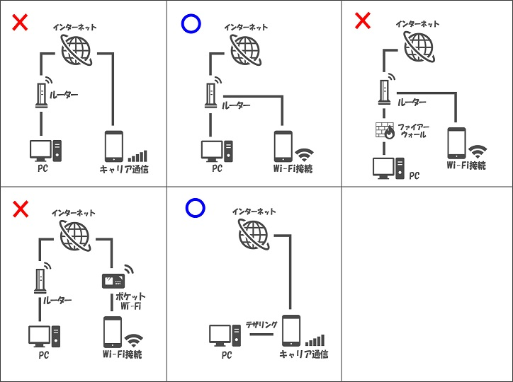
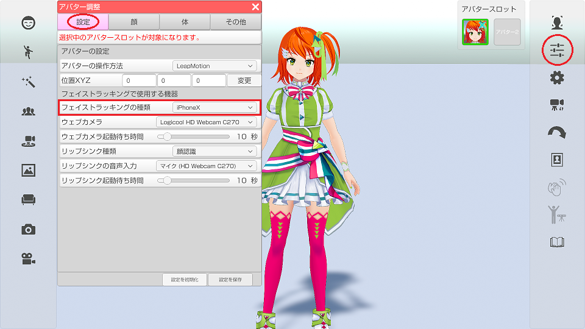
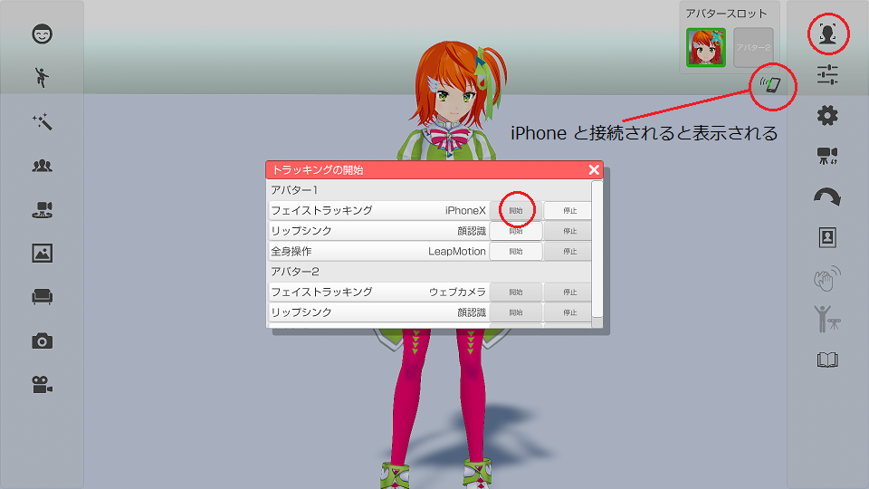

## iPhoneX フェイストラッキングについて

>iPhoneX 以降にフェイストラッキング アプリ 3teneFT をインストールする事で
>高精度のフェイストラッキング、アイトラッキングが 3tene (PRO、STUDIO) で利用できます。
>※3teneFREE では利用できません。

>また、iPhoneX の高精度のフェイストラッキングを利用することにより、
>左右別々でのまばたきも可能になっています。

### iPhone 用アプリ「3teneFT」のインストール

>上記リンクまたは App Store で 3teneFT を検索してインストールをしてください。

### 3tene と 3teneFT の接続について

>3tene と 3teneFT を接続するには iPhone の通信方法を WiFi に切り替える必要があります。
>キャリア通信(docomo、au、SoftBank)のインターネット経由では接続ができません。

>PC とルーターを接続し、そのルーターの WiFi に iPhone を接続してください。
>※3teneFT を利用する iPhone を PC と同じネットワークに接続する必要があります。

>また、 PC のセキュリティソフトのファイアーウォールが有効の場合に
>3tene と 3teneFT の接続がブロックされる事があります。
>使用しているセキュリティソフトのファイアウォール設定を変更する事で
>通信が可能になります。

>ファイアウォールの設定には完全に無効にする方法と
>指定したアプリのみブロック対象外にする設定が用意されている場合がほとんどです。

>ファイアウォールの完全無効はリスクを伴うので初回確認時のみ利用し、
>3teneFT との接続確認が取れてからは3tene の通信の許可や、ブロック対象外の設定を
>セキュリティソフトに追加して利用するようにしてください。

>#### セキュリティソフト

>Windows Defender ファイアウォール の設定は<a href="https://support.microsoft.com/ja-jp/help/4028544/windows-10-turn-windows-defender-firewall-on-or-off" target="_blank">こちら</a>
>アバスト <a href="https://www.avast.co.jp/" target="_blank">公式サイト</a>
>ウイルスバスター <a href="https://virusbuster.jp/" target="_blank">公式サイト</a>
>カスペルスキー <a href="https://www.kaspersky.co.jp/" target="_blank">公式サイト</a>
>ノートン <a href="https://jp.norton.com/" target="_blank">公式サイト</a>
>マカフィー <a href="https://www.mcafee.com/japan/home/" target="_blank">公式サイト</a>
>ESET <a href="https://eset-info.canon-its.jp/" target="_blank">公式サイト</a>

### 3teneFT側でIPアドレスの設定

>まずは 3teneFT に入力するIPアドレスを 3tene から確認します。
>設定 → 「システム」タブを選択してIPアドレスを表示します。

>アダプタが複数ある場合は１つづつ試してみてください。

### 3teneFT側でIPアドレスの入力

>画面下部の Host Address 内に確認したIPアドレスを入力します。

### 3tene と 3teneFT の接続方法

>3tene側
>・アバターの調整 → 「設定」タブ → フェイストラッキングの種類 を iPhoneX に変更します。

>さらに右側メニュー1番上の「顔認証の実行・停止」をクリックします。（アイコンが緑に変化）
>フェイストラッキングが開始されると iPhone からの接続待ち状態になります。

>3teneFT側
>・画面下部の確認ボタン（右側）をタップしマスクが顔を追跡することを確認します。
>　※認識しない場合は顔の認識を妨げるものを外してください。（サングラス、マスク等）

>画面下部の接続ボタン（左側）をタップすると接続を開始します。

>接続ボタンをタップしたタイミングで 3teneFT は中心位置を確定しますので
>下記の位置調整後に接続ボタンをタップしてください。

>1. iPhone の画面中心に顔が映るようにする。
>2. 顔からなるべく iPhone が離れた状態にする。（開始後は近づけても問題ありません。）
>3. 接続ボタンをタップする。

>※開始時の顔と iPhone の距離が近いとちょっとの傾きでもモデルが大きく傾きます。
>　位置調整は接続ボタンでやり直しが可能です。

>接続ボタンをタップすると状態が「未接続 → 接続要求中 → 接続中」の順に変化します。

>未接続 : 接続処理をしていない状態
>接続要求中 : 入力したIPアドレスに接続を試みています。
>接続中 : 接続が完了しています。アバターが動いているはずです。

>3tene と 3teneFT が接続されると 3tene の画面右上に接続アイコンが表示されます。
>3teneFT 側は「接続要求中」が「接続中」に変化します。

>10秒程度待って接続アイコンが表示されない場合は PC のファイアウォールの確認、
>もしくは 3teneFT 側のIPアドレス入力を確認してください。

>※アバターの調整「顔」の感度・倍率・まばたきの感度の設定を変更しても反映されません。

