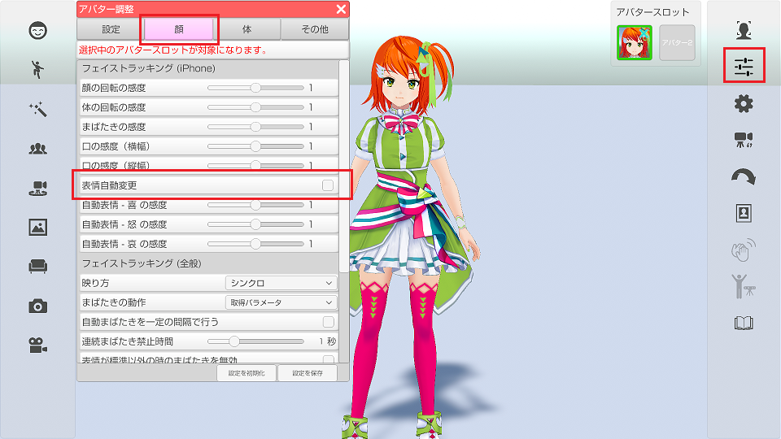
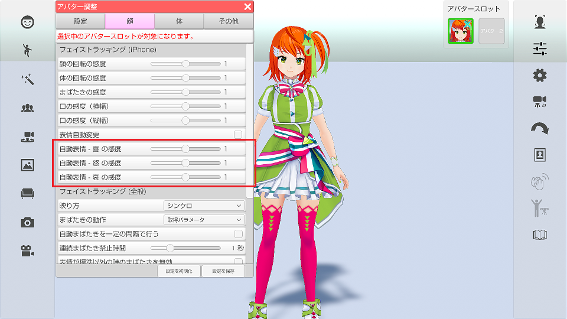
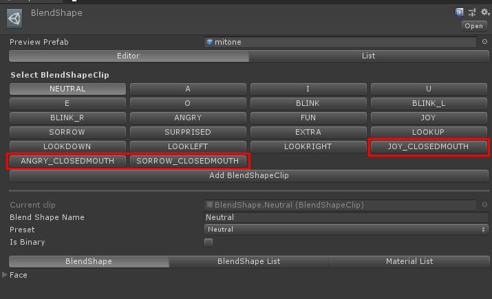

## iPhoneX フェイストラッキングの表情自動変更(表情認識)

### 表情の認識について

>iPhoneX の高精度なフェイストラッキングを使う事で演者の表情を読み取り、
>アバターの表情を「楽しい(Joy)、怒り(Angry)、悲しい(Sorrow)」に変更します。

>VRoidStudio 以外で作成した VRM モデルは
>VRM 標準の Joy、Angry、Sorrow の表情が存在している必要があります。

### 準備と設定

> 最初に iPhone でフェイストラッキングが動作する事を確認してください。
>[iPhoneXによるフェイストラッキングについて](#ft_iphone.md)

>アバター調整 → 「顔」タブ → 「表情自動実行」にチェックを付けます。

### 認識具合を確認する

>iPhoneX フェイストラッキングを開始します。

>表情認識は下記を意識して表情を作ると操作しやすくなります。

>Joy → 広角を広げる
>Angry → まゆげを下げる
>Sorrow → まゆげを上げる

>認識がうまく行われない場合は感度を変更する事で改善します。

### 自動表情変更と口の動きの競合について

>自動表情変更が有効な状態で口を動かすと表情の口と
>状態が競合して正常な口の形状にならない場合があります。
>（VRM モデルの作り方によって影響度が違います。）

>VRoidStudio で作成したモデルに対しては対策を行っているので
>競合は起きませんが、モデリングソフトで独自に作成したモデルは
>この問題の対象となります。

### 独自モデルの回避、自動表情変更で使用する表情のカスタム

>Unity で VRM に下記の名前の BlendShape を追加する事によって競合を回避可能となります。
また、自動表情変更で使用する表情をカスタムしたい場合も下記の名前で BlendShape を作成してください。
(作成した BlendShape が優先となります。)

>BlendShape名：Joy_ClosedMouth → 口だけを標準にした楽しい
>BlendShape名：Angry_ClosedMouth → 口だけを標準にした怒り
>BlendShape名：Sorrow_ClosedMouth → 口だけを標準にした悲しい

