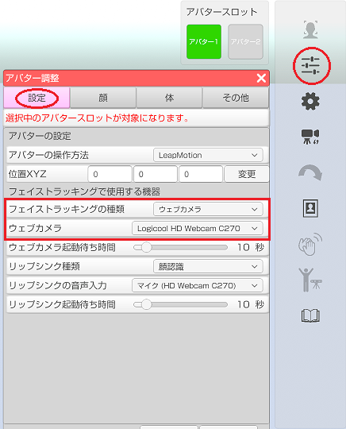
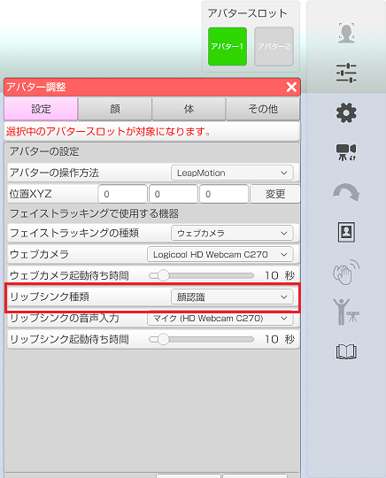
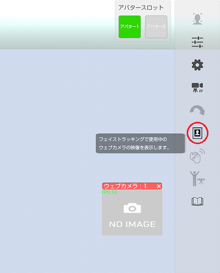

## フェイストラッキングについて

>一般販売されているウェブカメラを使ってフェイストラッキングを行います。
>ウェブカメラで撮影された画像の顔を認識して口、まぶた、頭の動きを反映します。

>Windows であればデバイスマネージャーでカメラを認識しているか確認可能です。
>※キャプチャボードからの入力には対応していないので注意してください。

>対応しているウェブカメラについては[こちら](#equipment.md)を参照してください。

>片目のまばたきや目線を動かす事はできません。
>※頭の動きは VR や Perception Neuron が優先されます。

### ウェブカメラを設定する

>3tene が起動していない状態で PC にウェブカメラを接続します。
>ウェブカメラの初回接続時に汎用ドライバが自動的にインストールされますが
>専用ドライバがある場合はそちらをインストールする事をお勧めします。
>※複数ウェブカメラ同時使用には専用ドライバが必要です。

>3tene を起動後、アバターの調整「設定」で接続したウェブカメラを選択します。

>ウェブカメラの撮影画像で口も動かす場合は
>リップシンク種類の項目で「顔認識」を選択します。

### フェイストラッキングを開始する

>右側メニューの一番の上のフェイストラッキングのアイコンをクリックして
>フェイストラッキングを開始します。
>口も同時に動かす場合は２番目のリップシンクのアイコンをクリックして
>リップシンクも開始します。

>3teneSTUDIO の開始操作は[こちら](#TrackingWindow.md)になります。

### ウェブカメラの映像を確認する

>右側メニューの7番目のウェブカメラプレビューのアイコンをクリックすると
>ウェブカメラの映像が表示されるプレビューウインドウを表示します。

>※[仮想ウェブカメラ(UnityCapture)](#VirtualWebCamera.md)を使用した出力では
>　プレビューウインドウはメニューと同様の扱いとなり録画対象となりません。

