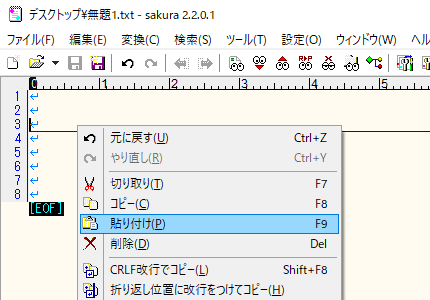

## 不具合の問い合わせ

最初に[FAQ](#faq.md)と[トラブルシューティング](#troubleshooting.md)を参照して
該当する問題が無いかを確認してください。

### 3tene の問い合わせフォームに記入

>公式サイトの[お問い合わせフォーム](https://3tene.com/contact/)に下記の内容を記入してください。
>PC構成の記入が無い場合、問い合わせ内容にお答えできない場合があります。

>1. 不具合の現象
>2. 不具合が発生する手順
>3. 3tene から取得したPC構成

### 3tene でPC構成を取得する手順

>設定ウインドウの「情報」タブを選択します。

>ボタンを押下するとクリップボードにテキストがコピーされます。
>テキストを張り付けたい場所で右クリック「貼り付け」を選ぶと
>クリップボードにコピーされたPC構成が入力されます。

