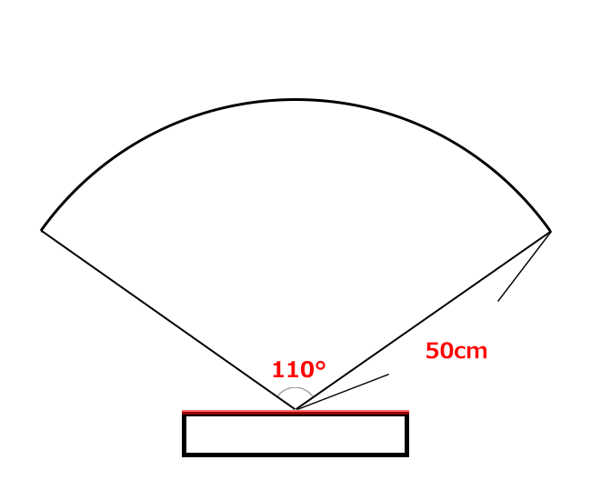
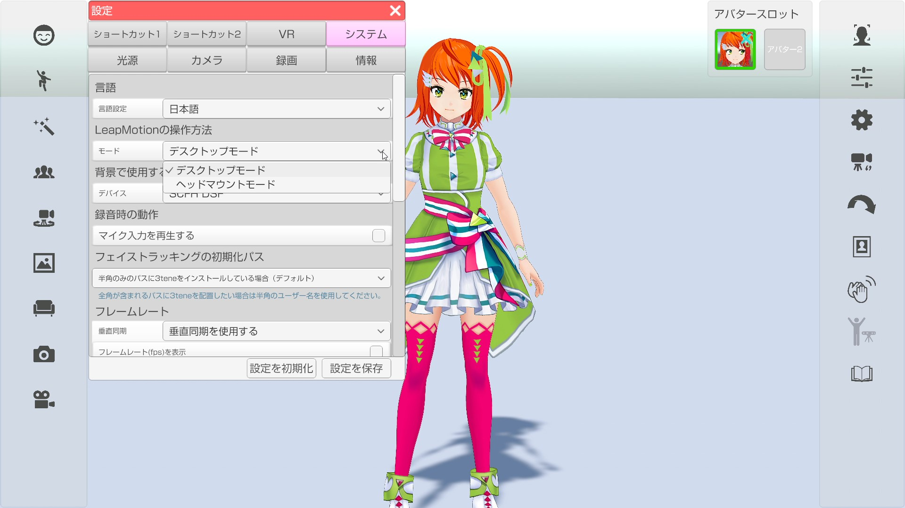
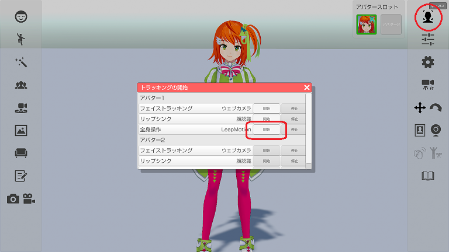

## LeapMotionについて

>専用センサーで腕、手、指を動かします。

>VR や AzureKinect 等、他の体を操作する機器との併用はできません。

### LeapMotion ソフトウェアのインストール

><a href="https://developer.leapmotion.com/vr-setup" target="_blank">公式サイト</a>より Leap_Motion_Setup_4.0.0.exe をダウンロードします。
>現在はダウンロードするのにログインが必要なようです。

>ダウンロード完了後、インストールしてください。
>※「V2 (Legacy Desktop Apps)」では動作しないので注意してください。

### LeapMotion の認識範囲

 >LeapMotion の認識範囲は中心角110°、半径50cmの範囲となっておりますので、
 >LeapMotionを使用する場合は、範囲内でのご利用をお願いいたします。

 

### LeapMotion の使用モードの切り替え

>設定 - システム - LeapMotionの操作方法 - モード から「デスクトップモード」「ヘッドマウントモード」を変更することが出来ます。
>※モード変更のドロップダウンを変更、後同ドロップダウンが再びアクティブになった際にモード変更が完了します。

>#### デスクトップモード
>膝もしくは机の上に LeapMotion を置き、その上で腕を動かします。
>※机の上だと位置が高く、センサーの範囲内に手を収めるのが難しい場合があります。

>#### ヘッドマウントモード
>ヘッドセット前面に LeapMotion を配置し、顔の前で腕を動かします。
>※ネックマウント等を使用した使い方はヘッドマウントモードになります。

### 3teneでの使用方法

> LeapMotion のソフトウェアがインストールされているのを確認してください。

> 1. LeapMotion を USB ケーブルで PC に接続します。
> 2. 3tene が Leap Motion を認識すると LeapMotion のアイコンがアクティブになります。
>    アイコンをクリックすると LeapMotion のカメラ映像が表示されます。
> 3. アバターの調整 → 設定 → アバターの操作方法 を「LeapMotion」に変更し、動作を確認します。
> 4. アバターの調整 → 体 → LeapMotion の項目を動きを見ながらそれぞれを調整します。

### ボディトラッキングを開始する (3tene V2 以降)

>右側メニューのトラッキング開始のアイコンをクリックして
>トラッキング開始のウインドウを表示します。
>全身操作の開始ボタンをクリックするとトラッキングが開始されます。

### 既知の不具合

>アバターの調整 → 顔 → 映り方 が「鏡」の場合、LeapMotionの動きがモデルの腕に上手く反映されない不具合があります。
>「シンクロ」での利用をお願いします。
