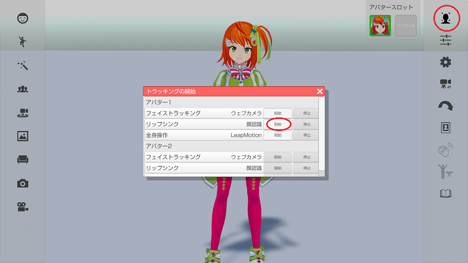

## リップシンクについて

>アバターの口を動かす機能で２種類あります。
>アバターの調整「顔」タブで設定を確認してください。

### リップシンクの種類

>・「顔認識」：フェイストラッキングで口を認識して動かす。
>・「音声認識」：マイクからの入力で口を動かします。

>顔認識は口の大きさや形状など個人差の影響を受けます。
>音声認識はＢＧＭや騒音をマイクで拾うと口が反応して動きます。

### リップシンク感度

>入力データの口の開き具合を補正します。
>数値が大きいほど口を大きく開きます。
>※Live2D用の設定。

### リップシンク応答性

>入力データに追従する速度を指定します。
>数値が大きいほど口が素早く動きます。

### リップシンクの有効、無効を切り替える

>右側メニューの上から２番目をクリックして有効、無効を切り替えます。

>3teneSTUDIO の開始操作は[こちら](#TrackingWindow.md)になります。

