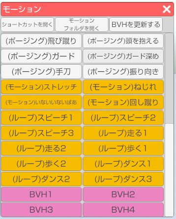

## モーション（VRM）について

>読み込んでいるアバターがVRMの場合、左側メニュー上から2番目の「モーション」アイコンをクリックするとVRM用モーションウインドウが開きます。
>ウインドウ内のモーションリストのボタンをクリックするとアバターが動きます。

### モーションデータリスト内のボタン背景別の説明

>白：デフォルトポーズ
>黄色：デフォルトモーション
>ピンク：読み込んだBVHモーション

### BVHファイルの読み込み方

>ウインドウ上部中央の「モーションフォルダを開く」をクリックするとフォルダが開きます。
>このフォルダに読み込ませたいBVHファイルを配置します。

>その後、ウインドウ上部右の「BVHを更新する」をクリックするとリストにBVHファイルが追加されます。

### ショートカットの設定

>ウインドウ上部の「ショートカットを開く」をクリックするとショートカット設定ウインドウが開きます。
>※3ten右側メニュー上から5番目の「設定」アイコンからも開くことが出来ます。
>ショートカットリストの中から該当のモーションにショートカットキーを設定することが出来ます。

