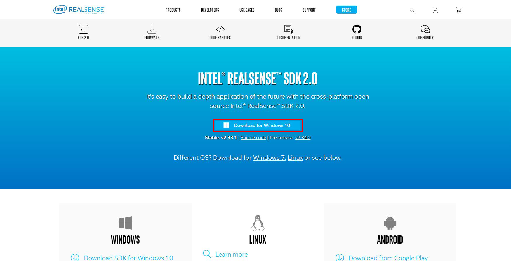

## Nuitrack について

>骨格認識によって全身を操作します。

### 注意事項

>・黒い衣服を着ていると認識率が低下します。
>・フェイストラッキングも Nuitrack を使用している場合に
>　全身を認識する距離まで離れると顔が認識できなくなる可能性が高いです。

### RealSenseの設定

>公式ホームページは<a href="https://www.intel.co.jp/content/www/jp/ja/architecture-and-technology/realsense-overview.html" target="_blank">こちら</a>

>SDKダウンロードページは<a href="https://www.intelrealsense.com/sdk-2/" target="_blank">こちら</a>

>SDKダウンロードページの「Download SDK for Windows 10」をクリック

>Intel.RealSense.SDK.exe のダウンロードが完了したら実行してインストールします。

### Nuitrackの設定

>公式ホームページは<a href="https://nuitrack.com/" target="_blank">こちら</a>

>ライセンスの購入（ライセンス購入前にトライアルにて動作確認を推奨します。）

>以下の設定の公式マニュアルは<a href="http://download.3divi.com/Nuitrack/doc/Installation_page.html" target="_blank">こちら</a>

>1. nuitrack-windows-x86.exe（Windows 32ビットの場合）またはnuitrack-windows-x64.exe のダウンロード、インストール
>nuitrack-windows-x86.exe（Windows 32ビットの場合）またはnuitrack-windows-x64.exe（Windows 64ビットの場合）を ダウンロードして実行します。
>「Windows によって PC が保護されました」と表示された場合は、詳細情報 → 実行 をクリックします。

>2. Microsoft Visual C ++ Redistributableをインストール（公式マニュアルの3のリンクから）

>3. システム環境変数が自動設定されていない場合は手動で設定
>コントロールパネル – システムとセキュリティ – システム – システムの詳細設定 – 環境変数 を開く

>>システム環境変数 – 新規 を開き、
>>変数名：NUITRACK_HOME
>>変数値：nuitrack-win64/nuitrackのパス
>>※デフォルトの場合は下記のパス
>>C:\Program Files\Nuitrack\nuitrack\nuitrack
>>上記を入力し登録

>>システム環境変数 – Path（変数名）を選択 – 編集 – 新規 を開き
>>nuitrack-win64/nuitrack/binのパス
>>デフォルトの場合は下記のパス
>>C:\Program Files\Nuitrack\nuitrack\nuitrack\bin
>>上記を入力し追加

>4. アクティベーション
>RealSense USB 3.0以上で接続する
>C:\Program Files\Nuitrack\nuitrack\nuitrack\activation_tool\Nuitrack.exe（デフォルトの場合）
>を管理者として実行（右クリック - 管理者として実行）
>Compatibility test をクリック
>Compatibility test が完了したら 「Enter Activation Key」に Activation Keyを入力し「Activate」をクリック
>（Trial版の場合 Activation Key は "license"から始まる文字列になります。）
>アクティベーションに成功すると下部に「Activation complete!」と表示される。

### Nuitrackによるフェイストラッキングの設定

>Nuitrackによるフェイストラッキングをご利用の際はお手数をお掛け致しますが、下記の手順を行ってください。

>Nuitrackのデフォルトの設定では、Nuitrackのフェイストラッキングはオフになっています。
>nuitrack\data\nuitrack.config
>上記ファイルを開き、「Faces.ToUse」と「DepthProvider.Depth2ColorRegistration」をtrueへ変更してください。

