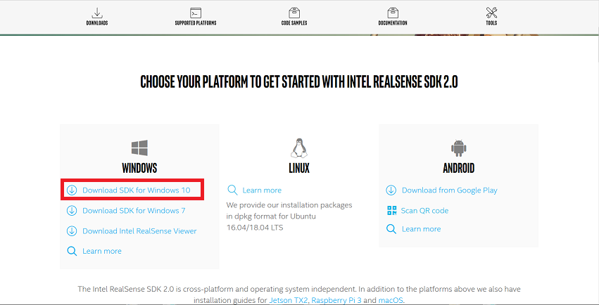

## Nuitrack について

>骨格認識によって全身を操作します。

### 注意事項

>・黒い衣服を着ていると認識率が低下します。
>・フェイストラッキングも Nuitrack を使用している場合に
>　全身を認識する距離まで離れると顔が認識できなくなる可能性が高いです。

### RealSenseの設定

>公式ホームページは<a href="https://www.intel.co.jp/content/www/jp/ja/architecture-and-technology/realsense-overview.html" target="_blank">こちら</a>

>開発者ページは<a href="https://www.intelrealsense.com/developers/" target="_blank">こちら</a>

>開発者ページの「Download SDK for Windows 10」をクリック

>Intel.RealSense.SDK.exe のダウンロードが完了したら実行してインストールします。

### Nuitrackの設定

>公式ホームページは<a href="https://nuitrack.com/" target="_blank">こちら</a>

>ライセンスの購入（ライセンス購入前にトライアルにて動作確認を推奨します。）

>nuitrack-win64.zipをダウンロード

>以下の設定の公式マニュアルは<a href="http://download.3divi.com/Nuitrack/doc/Installation_page.html" target="_blank">こちら</a>

>>1.nuitrack-win32.zip または nuitrack-win64.zip をダウンロードし、解凍。

>>2.Microsoft Visual C ++ Redistributableをインストール（公式マニュアルの2のリンクから）

>>3.nuitrack-win64（32）内のOpenNI-Win64（32）-1.5.7-Dev.msiをインストール

>>4.環境変数の設定

>コントロールパネル – システムとセキュリティ – システム – システムの詳細設定 – 環境変数 を開く
>ユーザー環境変数 – 新規 を開き、
>変数名：NUITRACK_HOME
>変数値：nuitrack-win64/nuitrackのパス
>上記を入力し登録
>ユーザー環境変数 – Path（変数名）を選択 – 編集 – 新規 を開き
>nuitrack-win64/nuitrack/binのパス
>上記を入力し追加
>3teneProのRealSense起動

### Nuitrackによるフェイストラッキングの設定

>Nuitrackによるフェイストラッキングをご利用の際はお手数をお掛け致しますが、下記の手順を行ってください。

>Nuitrackの設定の際にインストールした nuitrack-win64/nuitrack のデフォルトの設定では、
>Nuitrackのフェイストラッキングはオフになっています。
>nuitrack\data\nuitrack.config
>上記ファイルを開き、「Faces.ToUse」と「DepthProvider.Depth2ColorRegistration」をtrueへ変更してください。

