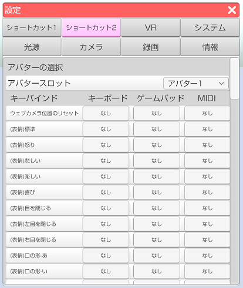

## ショートカットタブについて

>キーボードやゲームパッドを使用してモデル操作を行う機能です。

### ショートカットの設定の仕方

>ショートカットは設定ウインドウの中にあります。

>ショートカット1 はアバターに関連しないショートカットです。
>ショートカット2 はアバターに関連するショートカットです。

>ショートカットしたい項目をクリックすると入力ダイアログが表示されるので
>割り当てたいキーボードのキーかゲームパッドのボタンを押してください。

### 注意事項

>手の形状は VR、Nuitrack、PerceptionNeuron が動作時のみ使用可能です。
顔認識のみ、LeapMotion や Live2D ではこの機能は利用できません。

>PerceptionNeuron で使用する場合は「全ての指を制御する」のチェックを外す必要があります。

>・対象となる項目
>(左手)待機
>(左手)人差し指
>(左手)親指
>(左手)L字
>(左手)キラッ
>(左手)チョキ
>(左手)グー
>(左手)パー
>(右手)待機
>(右手)人差し指
>(右手)親指
>(右手)L字
>(右手)キラッ
>(右手)チョキ
>(右手)グー
>(右手)パー

