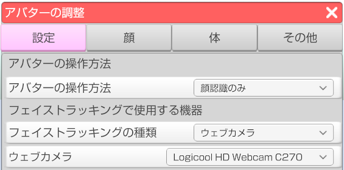

## トラブルシューティング

### 3tene が起動中のロゴ表示の後に止まってしまいます。

>2019/01/18 フェイストラッキングが原因の起動不具合を修正。
>2019/04/12 録音機器が原因の起動不具合を修正。

>最新の 3tene を試してみてください。

### 3tene が起動中に強制終了されます。

>2019/08/09 動画保存機能が原因で強制終了される問題の対策を導入しました。

>alt キーを押しながら 3tene を起動すると動画保存機能が無効になり起動する場合があります。
>起動するようになった場合は 3tene をインストールしたフォルダに
>「動画無効.txt」もしくは「DisableMovie.txt」を作成すると（中身はカラでOK）
>常に動画保存機能が無効になります。

### 3tene (Pro版) が起動中に強制終了されます。

>SteamVR の動作が不安定の場合に起こる事があるようです。
>SteamVR を終了し、VR 機器の接続（認識）を切った状態で起動してみてください。

### フェイストラッキングが動作しません！

>右側メニューのフェイストラッキングの開始ボタンは押していますか？
>動作中は緑色に変化します。
>※押し忘れている場合が多いです。

>また、アバターの調整で使用したいウェブカメラが指定されているかも確認してください。

### Windows でフェイストラッキングの開始を行うと初期化に失敗します。

>Windows で下記条件の場合に失敗するようです。
>※3tene のインスト－ルパスに全角文字があると失敗します。
>※アカウント名に全角文字があると失敗します。

>3tene の初期化パスの設定を変更すると改善する可能性があります。
>3tene の設定 → システム → 初期化パスを変更してください。

>RealSense 接続前に 3tene を起動して Nuitrack を使おうとしても失敗します。

### フェイストラッキングの開始でカメラ起動がタイムアウトします。

>3teneに対してカメラ使用を許可していない場合も失敗します。
>OS のセキュリティ機能で 3tene にカメラの使用を許可してください。

>Windows10 の場合
>設定 → プライバシー → カメラ で設定を変更してください。

>Mac の場合
>「システム環境設定」を選択して、「セキュリティとプライバシー」をクリック、
>「プライバシー」をクリックする。「カメラ」を選択する。
>リップシンクを使う場合は「マイク」の使用も許可してください。

>また、画面更新が停止しているウェブカメラを選択すると開始に失敗します。
>対象となるカメラの画面更新が行われるようにするか、
>3teneのアバターの調整「設定」で使用するウェブカメラを変更してください。

>Mac でウェブカメラの起動に時間がかかるようでタイムアウトする事が多いようです。
>3tene → アバターの調整 → 設定 で待ち時間を長く設定してください。
>※最近の Mac で発生する事が多いようです。

### Mac でフェイストラッキングを開始すると強制終了されます。

>3tene にカメラやマイクの使用権限が無い場合に強制終了してしまいます。

>Mac の「システム環境設定」を選択して、「セキュリティとプライバシー」をクリック、
>「プライバシー」をクリックする。「カメラ」を選択する。
>リップシンクを使う場合は「マイク」の使用も許可してください。

### フェイストラッキングを使うとモデルの頭が回転します。

>2019/03/29 顔が回転してしまう不具合を修正。
>2019/08/09 再度修正を行いました。
>最新の 3tene を試してみてください。

### iPhoneX にインストールした 3tene-FT がプチフリーズします。

>数十秒待つと復帰します。
>GPU 負荷で端末が一時的に停止してしまうようです。
>現在、対策を検討中です。

### ウェブカメラのプレビュー fps が極端に落ちる場合があります。

>部屋の明るさが極端に明るかったり、暗かったりすると
>ウェブカメラ内蔵の補正機能が働き、性能が極端に落ちる製品があります。
>明るさが一定に保てる場所に移動してみてください。

### リップシンクを音声認識に設定して開始すると失敗します。

>アバターの調整 → 設定から「リップシンク起動待ち時間」を長くしてみてください。
>※最近の Mac で発生する事が多いようです。

### LeapMotion が動作しません。

>別途、LeapMotion 付属ソフトウェアのインストールが必要です。

>ソフトウェアのインストール後に 3tene を起動します。
>3tene → アバターの調整 → 設定 → 操作方法を「LeapMotion」に変更します。

### LeapMotion の鏡の動作が正しく反映されません。

>今後、修正を行う予定です。

### VR が動作しません。

>別途、SteamVR のインストールが必要です。

>SteamVR のインストール後に 3tene を起動します。
>3tene → アバターの調整 → 設定 → 操作方法を「VR」に変更します。
>3tene → 設定 → VR → ゴーグルやトラッカーの部位設定を行います。

### Nuitrack の認識率が良くないです。

>壁際や暗い部屋、黒い服を着ていると認識率が低下します。
>また、Nuitrack のフェイストラッキングは全身が映る距離まで離れると
>D415 でも顔認識ができなくなる可能性が高いです。

### 動画保存を行うと音声が記録されません。

>仕様となります。
>音声も記録したい場合は OBS の使用をお勧めします。

### 背景のウェブカメラに仮想カメラを指定すると黒画面表示になります。

>仮想カメラソフトによって挙動が異なるようです。
>LogiCapture の場合は 3tene で背景ウェブカメラを LogiCapture で開始した後に
>本体の LogiCapture を起動すると正常表示するのを確認しています。
>LogiCapture を先に起動していると黒画面になるのを確認しています。

### 3tene を非アクティブにしてしばらくすると画面更新が止まったりチラツキます。

>2019/04/18 チラツキの対策を行いました。
>最新の 3tene を試してみてください。

