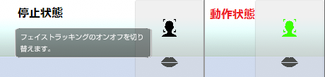
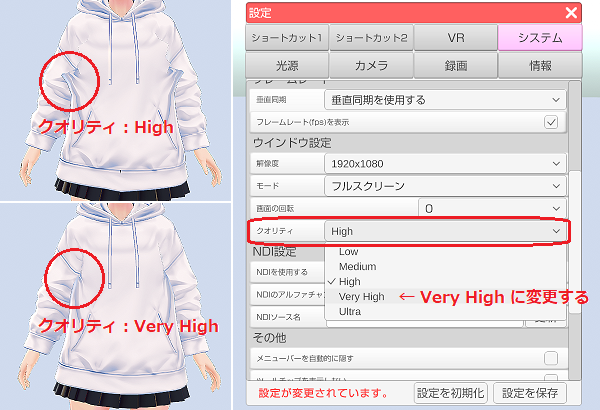

## トラブルシューティング

### 3tene が起動中のロゴ表示の後に止まってしまいます。

>2019/01/18 フェイストラッキングが原因の起動不具合を修正。
>2019/04/12 録音機器が原因の起動不具合を修正。

>最新の 3tene を試してみてください。

### 3tene が起動中に強制終了されます。

>2019/08/09 動画保存機能が原因で強制終了される問題の対策を導入しました。

>alt キーを押しながら 3tene を起動すると動画保存機能が無効になり起動する場合があります。
>起動するようになった場合は 3tene をインストールしたフォルダに
>「動画無効.txt」もしくは「DisableMovie.txt」を作成すると（中身はカラでOK）
>常に動画保存機能が無効になります。

>動画保存を行いたい場合は別途 OBS をインストールして 3tene を録画してください。

### 3tene (Pro版) が起動中に強制終了されます。

>SteamVR の動作が不安定な場合に起こる事があるようです。
>SteamVR を終了し、VR 機器の接続（認識）を切った状態で起動してみてください。

### Mac で開発元が未確認と表示され 3tene が起動できません。

>MacOS のバージョンによって対処が異なります。

>・10.15.x Catalina 共通対処法（Mac が２台必要。）
>Catalina ではない Mac で 3tene をダウンロードして zip を解凍する。
>解凍して生成されたフォルダを zip に再圧縮する。
>再圧縮した zip ファイルをUSBメモリで Catalina の Mac にコピーして解凍する。
>3tene を実行する。

>・10.15.2 Catalina
>対処方法が確立できておりません。

>・10.15.1 Catalina
>確認しておりません。

>・10.15 Catalina
>ターミナルから下記のように入力します。
>sudo spctl --master-disable
>実行するとパスワード入力が求められるので入力します。
>上部メニューの「アップル」メニューから「システム環境設定」を選択。
>「セキュリティとプライバシー」選択して「一般」タブを選択。
>左下の「錠前（カギ）」をクリックしてパスワードを入力する。
>「すべてのアプリケーションを許可」を選択する。
>3tene を実行する。

>・10.14.x Mojave 以前
>Control キーを押しながら3teneアイコンをクリック。
>「開く」で強制的に起動する。

### フェイストラッキングが動作しません！

>右側メニューのフェイストラッキングの開始ボタンは押していますか？
>動作中は緑色に変化します。
>※押し忘れている場合が多いです。

>

>また、アバターの調整で使用したいウェブカメラが指定されているかも確認してください。
>確認方法は[こちら](#ft_webcamera.md)を参照してください。

### Windows でフェイストラッキングの開始を行うと初期化に失敗します。

>Windows で下記条件の場合に失敗するようです。
>※3tene のインスト－ルパスに全角文字があると失敗します。
>※アカウント名に全角文字があると失敗します。

>3tene の初期化パスの設定を変更すると改善する可能性があります。
>3tene の設定 → システム → 初期化パスを変更してください。

>RealSense 接続前に 3tene を起動して Nuitrack を使おうとしても失敗します。

### フェイストラッキングの開始でカメラ起動がタイムアウトします。

>Windows 10 バージョン 1803 以降および Mac を使用している場合は
>3teneに対してカメラ使用を許可しないとタイムアウトします。
>OS のセキュリティ機能で 3tene にカメラの使用を許可してください。

>Windows10 (バージョン 1803,1809) の場合
>設定 → プライバシー → カメラ でアプリの設定を変更してください。

>Windows10 (バージョン 1903 以降) の場合
>設定 → プライバシー → カメラ でデスクトップアプリ設定（全体）を変更してください。

>Mac の場合
>「システム環境設定」を選択して、「セキュリティとプライバシー」をクリック、
>「プライバシー」をクリックする。「カメラ」を選択する。
>リップシンクを使う場合は「マイク」の使用も許可してください。

>さらにセキュリティソフトをインストールしている場合には
>セキュリティソフトによってカメラがガードされている場合もありますので
>セキュリティソフトの設定も確認してください。

>また、画面更新が停止しているウェブカメラを選択すると開始に失敗します。
>対象となるカメラの画面更新が行われるようにするか、
>3teneのアバターの調整「設定」で使用するウェブカメラを変更してください。

>Mac のウェブカメラ起動時間は長い為、タイムアウトする事が多いようです。
>3tene → アバターの調整 → 設定 で待ち時間を長く設定してください。
>※最近の Mac で発生する事が多いようです。

### Mac でフェイストラッキングを開始すると強制終了されます。

>3tene にカメラやマイクの使用権限が無い場合に強制終了してしまいます。

>Mac の「システム環境設定」を選択して、「セキュリティとプライバシー」をクリック、
>「プライバシー」をクリックする。「カメラ」を選択する。
>リップシンクを使う場合は「マイク」の使用も許可してください。

### ウェブカメラを２つ接続しましたがどちらか片方しか動作しません。

>下記のデバイスの組み合わせで同時使用が出来ないのを確認しています。
>※ウェブカメラが標準ドライバで動作していると同時に使用できない可能性があります。

>BUFFALO BSW20K07H (デバイス名：PC Camara → 標準ドライバ)
>BUFFALO BSW200MBK (デバイス名：USB_Camera → 標準ドライバ)

>メーカーから専用ドライバが配布されている場合はそちらを試してみてください。
>ドライバの変更は自己責任となりますのでご注意ください。

>なお、下記組み合わせで３台の同時使用が出来るのを確認しています。

>BUFFALO BSW20KM05 (デバイス名：PC Camara → 標準ドライバ)
>Logicool HD Webcam C270 (デバイス名：Logicool HD Webcam C270 → 専用ドライバ)
>Logicool HD Webcam C270 (デバイス名：Logicool HD Webcam C270 → 専用ドライバ)

### フェイストラッキングを使うとモデルの頭が回転します。

>2019/03/29 顔が回転してしまう不具合を修正。
>2019/08/09 再度修正を行いました。
>最新の 3tene を試してみてください。

### iPhoneX にインストールした 3teneFT と接続できません。

>下記の２点を確認してください。
>・iPhoneX と PC が同じルーターに接続されている。
>・3tene (PC) セキュリティソフトでファイウォールが適切に設定されている。

>特にファイルウォールの設定を行っていないケースが多いです。

>接続方法については[こちら](#ft_iphone.md)を参照してください。

### iPhoneX にインストールした 3teneFT がプチフリーズします。

>2020/02/14 3teneFT v1.1.0 にて修正を行いました。
>3tene 本体も v1.10.20 2020/02/14 以降を使用する必要があります。

><S>数十秒待つと復帰します。
>GPU 負荷で端末が一時的に停止してしまうようです。</S>

### ウェブカメラのプレビュー fps が極端に落ちる場合があります。

>部屋の明るさが極端に明るかったり、暗かったりすると
>ウェブカメラ内蔵の補正機能が働き、性能が極端に落ちる製品があります。
>明るさが一定に保てる場所に移動してみてください。

### リップシンクの設定で録音デバイスを認識していません。

>新しい Windows10 で本体のミニプラグ端子にマイクを接続して使用する場合は
>マイクをミニプラグに刺していないと録音デバイスを認識しない仕様になったようです。
>3tene でミニプラグ接続のマイクを使用する場合は常に接続しているようにしてください。

### リップシンクを音声認識に設定して開始すると失敗します。

>アバターの調整 → 設定から「リップシンク起動待ち時間」を長くしてみてください。
>※最近の Mac で発生する事が多いようです。

### リップシンクを音声認識に設定して開始しても反応しません。

>OS (Windows,Mac) の録音機器に関連する音量やミュートの設定を確認してください。
>複数の録音機器が接続されている場合には
>アバターの調整 → 設定から「リップシンクの音声入力」が
>使用したい録音機器になっているかを確認してください。

### LeapMotion が動作しません。

>LeapMotion の動作には専用ソフトウェア(Ver 4 系)のインストールが必要となります。
>専用ソフトは公式サイトよりダウンロードしてください。
>Orion Ver 4.0.0+52173 で動作するのを確認しています。

>専用ソフトウェアのインストール後に 3tene を起動します。
>3tene → アバターの調整 → 設定タブ → 操作方法を「LeapMotion」に変更します。

### LeapMotion の鏡の動作が正しく反映されません。

>今後、修正を行う予定です。

### Perception Neuron が動作しません。

>別途、Axis Neuron (PRO) のインストールが必要です。

>Axis Neuron を起動して設定変更を行う。
>　※Settingsの「Broadcating」タブを選択し、「BVH」の「Enable」を選択する。
>Axis Neuron で Perception Neuron のハブに接続を行う。
>Axis Neuron で Perception Neuron のキャリブレーションを行う。
>Axis Neuron を起動したまま 3tene を起動します。
>3tene → アバターの調整 → 設定 → 操作方法を「PerceptionNeuron」に変更します。

>[Perception Neuronについて](#PerceptionNeuron.md)

### VR が動作しません。

>別途、SteamVR のインストールが必要です。

>SteamVR のインストール後に 3tene を起動します。
>3tene → アバターの調整 → 設定 → 操作方法を「VR」に変更します。
>3tene → 設定 → VR → ゴーグルやトラッカーの部位設定を行います。

### HTC Vive から HTC Vive Pro に交換したら動きません。

>SteamVR が極端に古い場合はアップデートが必要です。

>アップグレード版でゴーグルとリンクボックスを交換した場合は
>コントローラの再ペアリングをする必要があります。

>フルセット版の場合はペアリングとルームの再設定が必要です。

### RealSense + Nuitrack が動作せず、プレビューが真っ白です。

>アクティベーションが完了していないか他のソフトと競合しています。
>[こちら](#Nuitrack.md) で手順を確認してください。

### 動画保存を行うと音声が記録されません。

>仕様となります。
>音声も記録したい場合は OBS の使用をお勧めします。

### OBS でプレビュー表示ができません。

>3tene v1.10.20 2020/02/14 以降ではウインドウキャプチャではなく
>ゲームキャプチャからウインドウを指定するようにしてください。

>なお、OBS との連携では[仮想ウェブカメラ](#VirtualWebCamera.md)を経由した
>映像キャプチャデバイスによる使用が推奨されます。
>メニューやウインドウを表示したい場合はゲームキャプチャを使用してください。

### VRoid Studio で作成したアバターの表示が崩れる場合があります。

>複雑な頂点構成のアバターで発生する事があるようです。
>設定「システム」タブでクオリティを「Very High」以上に変更してみてください。
>改善される場合があります。
>ただし、処理負荷が増えるのでパフォーマンスは低下します。

>
>※VRoid Studio でパーカーを使用している場合。

### 自作した VRM の表情を変更すると目や口が２重に表示されてしまいます。

>3tene では VR に対応している為、VRM は First Person に対応している必要があります。
>VRM を First Person に対応させるか、「Third Person Only」に設定変更を行い、
>First Person を無効にしてください。

### アバターの頭や顔のパーツが描画されません。

>シーンカメラがアバターに近いと発生するようです。
>DirectX 11 に対応している GPU (内蔵グラフィック) だと発生しないようです。

>2019/03/14 強制描画を行うオプションを追加しました。（標準でON）
>最新の 3tene を試してみてください。

### Intel Core 2000 番台の内蔵グラフィックを使用していますが描画が崩れる事があります。

>Intel Core 2000 番台に搭載されている GPU (内蔵グラフィック) は対象外となります。

>Intel Core シリーズの内蔵グラフィックを使用する場合は 4000 番台以降が対応となります。
>※MacBook (Pro, Air 含む) 2011、2012 は対象外となります。

>デスクトップPCであればグラフィックボード(GPU) を追加する事で改善される可能性はありますが、
>グラフィックボードの追加および交換は自己責任となります。
>※DirectX 11 以降に対応したグラフィックボードを使用してください。

>[動作環境](#required.md)

### 背景のウェブカメラに仮想ウェブカメラを指定すると黒画面表示になります。

>仮想ウェブカメラソフトによって挙動が異なるようです。
>LogiCapture の場合は 3tene で背景ウェブカメラを LogiCapture で開始した後に
>本体の LogiCapture を起動すると正常表示するのを確認しています。
>LogiCapture を先に起動していると黒画面になるのを確認しています。

### ショートカットの左手、右手が動作しません

>全身トラッキング中(VR, Nuitrack, Perception Neuron)のみ動作します。
>[仕様条件](#shortcut.md)を見たいしているかを確認してください。

>Perception Neuron の場合はアバター調整の「設定」→「全ての指を制御する」の
>チェックを外していないと手の形状は変化しません。

### オブジェクトの読み込みで失敗します。

>読み込みたいオブジェクトのファイルパスに日本語のフォルダが
>入っていると失敗します。
>日本語が含まれないパスにファイルを移動してから読み込みを行ってください。

### 3tene を非アクティブにしてしばらくすると画面更新が止まったりチラツキます。

>2019/04/18 チラツキの対策を行いました。
>最新の 3tene を試してみてください。

